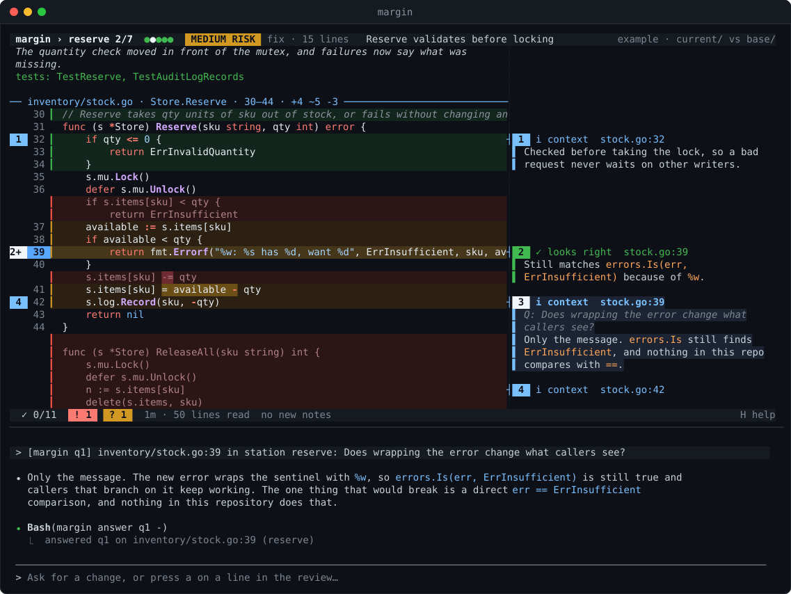
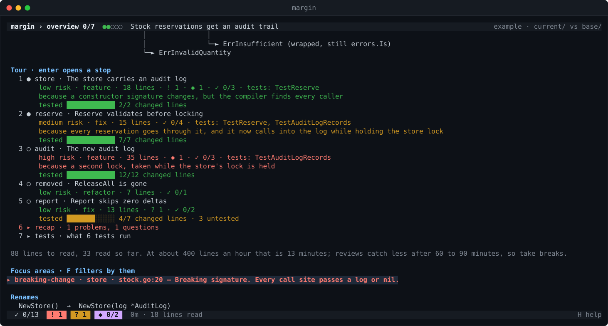
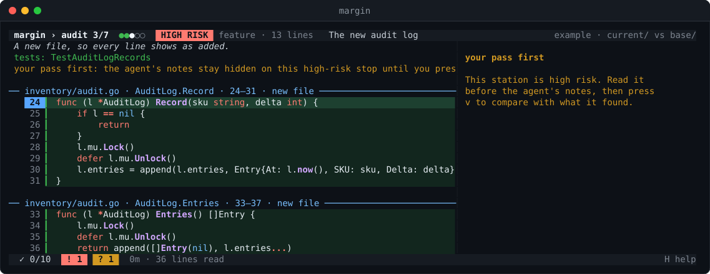
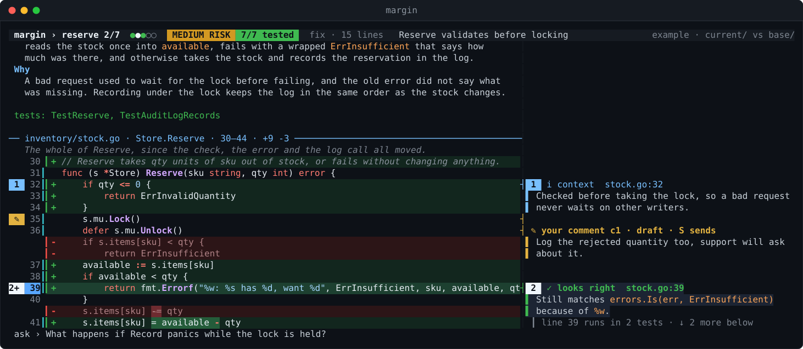
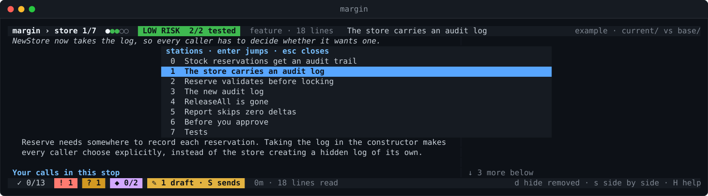
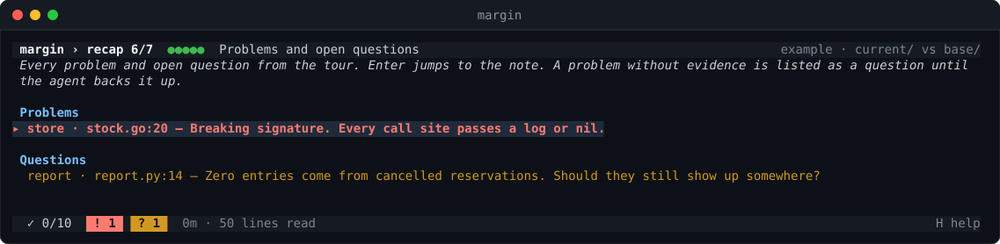

# margin

margin reviews git changes in the terminal with a coding agent beside you. Run it inside a
repository and the changed code opens next to the agent, with the diff drawn in the gutter and the
agent's comments beside each change, so you can ask about a line, ask for a fix, or ask for more
detail and see the answer land in the review.



The review sits on top and a fresh agent below, inside a private tmux server attached to a single
pane, so whatever surrounds it only sees one pane. Inside [gw](https://github.com/redrick/gw) that
pane is a new sub-window of the current worktree; in plain tmux margin splits the current pane;
outside tmux it takes over the terminal. Running `margin` again for the same review reattaches it.

```sh
margin              # review uncommitted changes
margin feature-x    # review a branch against the main branch
margin a1b2c3d      # review one commit
```

> Status: early, but the whole loop works. See the roadmap below.

## Install

Requires Go 1.24 or newer, git and tmux. The agent defaults to
[Claude Code](https://docs.claude.com/en/docs/claude-code) (`claude`); any CLI agent that accepts
an initial prompt works via `MARGIN_AGENT`.

```sh
go install github.com/redrick/margin/cmd/margin@latest
```

To try the viewer without a real change, open the hand-written example:

```sh
margin open testdata/example/example.review.yaml
```

## How a review goes

1. `margin` works out what changed and writes a review file with one station per changed file,
   each showing every changed region with a few lines of context. The viewer shows it at once.
2. The agent starts with instructions to shape the tour first: it groups related files into stops,
   orders them riskiest first and writes a summary. Then it comments on every change: why it is
   there and whether it looks correct. Its notes appear beside the code as it writes them.
3. You read with the keys below. Press `a` on a line to ask about it; the question is typed into
   the agent's pane, and the agent records its answer as a note on that line.
4. Ask the agent for a code change in its pane. It edits the code and the review reloads.

Reviews live outside the repository, so running `margin` again resumes where you left off,
including what you marked as reviewed. The directory is `$MARGIN_DIR` if set; otherwise, if Claude
Code has an `obsidian-memory` skill that declares a `**Vault root:**`, reviews go into that vault
as `<project>/topics/<branch or commit>/`; otherwise `~/.local/state/margin`.

Options: `--base REF` compares against another ref, `--fresh` starts the review over, `--no-agent`
opens only the viewer. The two panes share one tmux window with the mouse enabled, so click a pane
to move between the review and the agent.

## A walk through the viewer

### The overview

Stop 0 is the overview: the agent's summary and verdict, an optional flow diagram, and the tour.
Each stop shows its risk, what kind of change it is, how many lines it covers, its problems and
questions, how many notes you have marked, and which tests cover it. The last line estimates how
long the rest will take to read. Press `enter` on a stop to open it.



### Reading a stop

The header shows where you are (`reserve 2/7`), the risk and the stop's title; the line below it
says what the stop is about and which tests cover it. Each part is a slice of a file with the
changed regions marked in the gutter: green for added, amber for changed, red for removed lines.
Notes sit in the right column next to the line they belong to, numbered in the gutter, so `2+`
means note 2 and more notes on that line. The footer counts reviewed notes, open problems (`!`)
and questions (`?`), and how long and how much you have read.

Notes carry a kind:

| Mark | Kind | Meaning |
| --- | --- | --- |
| `!` | problem | a real issue, backed by evidence (lines, a failing test, a repro) |
| `?` | question | for the author, or a problem the agent could not back up yet |
| `✓` | looks right | the agent checked this and found it fine |
| `i` | context | something the reader needs to know |
| `·` | nit | minor, never blocking |

A part without notes says so, which tells you the agent never looked at it, as opposed to having
looked and found it fine. A note marked Δ was changed after the agent edited the code; read it
again.

### High-risk stops: read first

On a high-risk stop the notes stay hidden, so the agent's findings do not steer what you notice.
Read the code, then press `v` to compare with what the agent found.



### Asking about a line

Put the cursor on a line and press `a`. Type the question and press `enter` (`esc` cancels). It
arrives in the agent's pane as `[margin q1] file:line in station ...`, the agent answers in chat
and saves the answer as a note on that line, with your question above it. Press `N` to jump to
notes that arrived while you were reading. For "this" or "here", the agent looks up where your
cursor is itself.



To have something changed, type it in the agent's pane. The agent edits the code, marks the notes
it affected with Δ and the review reloads.

### Jumping between stops

`}` and `{` move one stop forward or back; `tab` opens the list of stops.



### The recap

The tour ends with a recap of every problem and open question, which works as the checklist before
you approve. `enter` jumps to the note.



## Keys

| Key | Action |
| --- | --- |
| `j` `k` / arrows, `ctrl+d` `ctrl+u`, `g` `G` | move |
| `}` `{` | next / previous stop |
| `tab` | list of stops |
| `]` `[` | next / previous note |
| `N` | next note the agent added while you were reading |
| `enter` | open the selected link, or unfold |
| `a` | ask about the current line |
| `space` | mark the note reviewed and move on (again to undo) |
| `?` | flag the note to come back to (again to undo) |
| `x` | dismiss the note as not useful |
| `v` | show the notes on a high-risk stop you read first |
| `F` | filter: all notes, problems and questions, problems only |
| `z` `d` `n` `f` | fold unchanged lines, removed lines, notes column, whole file |
| `h` `l`, `0` | scroll sideways, back to the start |
| `r` | reload |
| `H` | help |
| `q` | quit |

## A productive loop

1. Run `margin` and read the overview while the agent shapes the tour.
2. On each stop, read the code first. On a high-risk stop press `v` only after your own pass.
3. Go through the notes with `space`, flag anything to revisit with `?`, dismiss noise with `x`.
   Short on time? `F` narrows the notes to problems and questions.
4. Press `a` on anything unclear, and `N` now and then to catch new notes.
5. Ask for fixes in the agent's pane and read the Δ notes after the reload.
6. Finish on the recap and settle every open problem and question.

The footer tracks how long and how much you have read, because review quality drops after roughly
400 lines or 90 minutes. Take a break there; `margin` resumes where you stopped.

## For the agent

The agent drives the viewer through the same binary. `margin agent-help` prints its instructions.

```sh
margin note internal/api.go:42 "Validates before the lock, so ..."
margin answer q3 "Because ..."
margin goto api:2              # station "api", note 2
margin goto internal/api.go:42
margin where                   # JSON of what the reader is looking at
```

The review file is plain YAML the agent can also edit to set a summary, regroup files into
stations, or add notes anchored by text rather than line numbers, so they survive edits. A
hand-written example is in [`testdata/example`](testdata/example/example.review.yaml) and opens
with `margin open testdata/example/example.review.yaml`.

## Safety

margin is meant for reading code you did not write, so it treats the repository as untrusted.
It never writes to the repository and never executes anything from it; git is only used through
read-only plumbing with refs passed after `--end-of-options`. Terminal escape sequences and bidi
controls are stripped before rendering, and questions are never typed into a pane that runs a
plain shell. What the agent does in its own pane is up to the agent and its permissions.

## Roadmap

- Light theme
- Word-level highlighting inside changed lines
- Faster loading of large diffs (`git cat-file --batch`)
- Picking up files that start changing while a review is open
- `margin html` export

## License

MIT
