# margin

margin reviews git changes in the terminal with a coding agent beside you. Run it inside a
repository and the changed code opens next to the agent, with the diff drawn in the gutter and the
agent's comments beside each change, so you can ask about a line, ask for a fix, or ask for more
detail and see the answer land in the review.


The review sits on top and a fresh agent below, inside a private tmux server attached to a single
pane, so whatever surrounds it only sees one pane. Inside [gw](https://github.com/redrick/gw) that
pane is a new sub-window of the current worktree; in plain tmux margin splits the current pane;
outside tmux it takes over the terminal. Running `margin` again for the same review reattaches it.

```sh
margin              # review uncommitted changes
margin --staged     # review only what is staged
margin feature-x    # review a branch against the main branch
margin a1b2c3d      # review one commit
margin --pr 123     # review a GitHub pull request (read-only)
```

> Status: early, but the whole loop works. See the roadmap below. New to it? Jump to
> [How to use it, really](#how-to-use-it-really) for a whole review, step by step.

## Install

Requires Go 1.24 or newer, git and tmux. The agent defaults to
[Claude Code](https://docs.claude.com/en/docs/claude-code) (`claude`); any CLI agent that accepts
an initial prompt works via `MARGIN_AGENT`.

```sh
go install github.com/redrick/margin/cmd/margin@latest
```

To try the viewer without a real change, open the hand-written example:

```sh
margin open testdata/example/example.review.yaml
```

## How a review goes

1. `margin` works out what changed and writes a review file with one station per changed file,
   each showing every changed region with a few lines of context. It also records what the change
   was meant to do, from the commit messages, the pull request description or `--intent`. The
   viewer shows it at once.
2. The agent starts with instructions to shape the tour first: it compares the change with what
   was asked, groups related files into stops, orders them riskiest first, says why each stop is
   risky and writes a summary. Every change has to land in a stop or in the list of things safe to
   skip. Then it comments on every change: why it is there and whether it looks correct. Its notes
   appear beside the code as it writes them.
3. The agent measures which tests run which changed lines (see [Test coverage](#test-coverage)),
   so the gutter shows untested code and the Tests stop shows what each test exercises.
4. You read with the keys below. Press `a` on a line to ask about it; the question is typed into
   the agent's pane, and the agent records its answer as a note on that line.
5. Ask the agent for a code change in its pane. It edits the code, measures coverage again and
   the review reloads.

Reviews live outside the repository, so running `margin` again resumes where you left off,
including what you marked as reviewed. The directory is `$MARGIN_DIR` if set; otherwise, if Claude
Code has an `obsidian-memory` skill that declares a `**Vault root:**`, reviews go into that vault
as `<project>/topics/<branch or commit>/`; otherwise `~/.local/state/margin`.

Options:

| Option | What it does |
| --- | --- |
| `--base REF` | compare against another ref |
| `--staged` | review the index instead of the working tree |
| `--pr N` or `--pr URL` | review a GitHub pull request, see [Pull requests](#pull-requests) |
| `--intent "..."` | say what the change was meant to do, when the commit messages do not |
| `--instructions "..."` | tell the agent what to pay attention to in this review |
| `--fresh` | start the review over |
| `--no-agent` | open only the viewer |

The two panes share one tmux window with the mouse enabled, so click a pane to move between the
review and the agent.

### Pull requests

`margin --pr 123` (or the pull request's URL) asks the GitHub CLI `gh` for the pull request's
title, description, base branch and head commit, and reviews the head against its merge base with
the base branch. margin only reads from GitHub and never fetches, so the head commit has to be in
your repository already; if it is not, margin prints the `git fetch` to run. The description
becomes what the change was asked to do.

## How to use it, really

A whole review, from the first command to the posted comments. The keys are the only thing to
learn; `H` shows them at any time.

**1. Start it where the change is.** In the repository, run the command that matches what you are
reviewing:

```sh
margin                            # your own uncommitted work, before you commit it
margin --staged                   # only what you have staged
margin feature-x                  # a branch, against main
margin --pr 123                   # someone's pull request (git fetch origin pull/123/head first)
margin --intent "Support needs a history of stock changes"   # when the commits do not say why
```

The review opens on top and the agent below. Add `--instructions "check the migration is
reversible"` when you already know what worries you.

**2. Read the overview while the agent works.** For the first minute or two the agent shapes the
tour, and the overview fills in as it saves. Read *Asked*, *Did* and *Gap* first: if the change
does something nobody asked for, or misses part of the ask, that is the most important finding of
the review and you have it before reading any code. Then look over the tour: which stops are high
risk and why, which have calls for you, which have untested lines. Check *Problems with the review
file* at the bottom; "changes no stop shows" there means the agent has not placed everything yet.

**3. Walk the stops in order.** Press `enter` on the first stop, or `}`. For each stop:

- Read the lede, the risk line and the three rationale paragraphs, then the calls listed under
  *Your calls in this stop*, so you know what you are weighing before you see the code.
- Read the code. On a high-risk stop the notes are hidden: form your own view, then press `v` and
  compare.
- Step through the notes with `]` and `[`. `space` marks one read (or a call made), `?` flags one
  you want in your review, `x` dismisses one that did not help.
- Something unclear? `a` asks the agent about the cursor line and the answer arrives as a note.
  Something to change? `c` writes a comment and keeps reading; press `S` at the end of the stop to
  hand over every comment at once. For bigger requests, click the agent's pane and type.
- `u` jumps to the next changed line no test runs. If it matters, comment on it.
- `}` moves to the next stop. The dots in the header show which stops you have visited.

Short on time? `F` narrows the notes to problems, questions and calls, or to one focus area such
as `security`.

**4. Let the agent fix things.** After `S`, the agent works through your comments in its pane,
changes code where you asked, and closes each comment with its answer. The review reloads by
itself: `N` jumps to the new notes, notes marked Δ changed with the code, and coverage is measured
again.

**5. Finish on the recap.** The last stop is the checklist: every call you still have to make,
every problem and open question, and each of your comments with its state. Settle each one, and
`enter` on an entry takes you back to its line.

**6. Post it.** `margin export` prints your comments with the agent's answers, the notes you
flagged and your calls, ready to paste into the pull request. `margin export --format github`
prints a review to post with `gh api`. margin never posts on its own.

**7. Stop any time.** Press `q`. Running the same `margin` command later reopens the review where
you left it, with your marks, comments and the agent's notes; new changes since then are added.

The footer tracks how long and how much you have read, because review quality drops after roughly
400 lines or 90 minutes. Take a break there; `margin` resumes where you stopped.

### Making a repository margin-friendly

Two optional files under `.margin/` pay off on repositories you review often: `ignore` for
generated files that need no stop, and `instructions` for what reviewers should always check. See
[Repository settings](#repository-settings).

## A walk through the viewer

### What was asked, and what was done

A change can only be judged against what it was meant to do, so stop 0 opens with that:

- **In plain words**: optionally, one sentence on what bothered someone and one on what is better
  now, written for someone in their first week.
- **Asked**: what the change was meant to do, taken from the commit messages, the pull request
  description or `--intent`. margin writes this; the agent does not edit it.
- **Did**: what the change actually does, in the agent's words.
- **Gap**: where the change does more, less or something other than asked. It is amber when there
  is a gap and green when the agent found none.

When nothing says what the change was for, the overview says so instead of guessing.

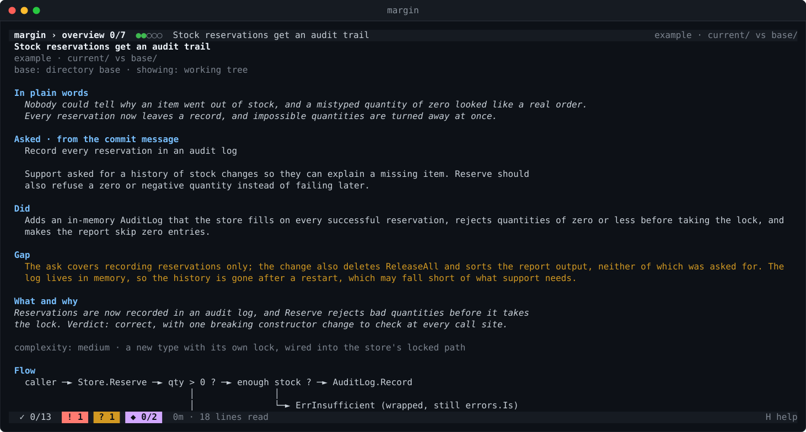

### The overview

Below that come the agent's summary and verdict, how complex the change is, an optional flow
diagram, and the tour. Each stop shows its risk and why it has that risk, what kind of change it
is, how many lines it covers, its problems, questions and calls, how many notes you have marked,
and which tests cover it. Once coverage is measured, each stop also gets a bar of how many of its
changed lines a test runs. The last line estimates how long the rest will take to read. Press
`enter` on a stop to open it.

Further down, **Focus areas** lists the notes the agent tagged as security, breaking change, data
integrity, concurrency, performance and so on, and `F` filters the notes by them. Files left out
by the repository's `.margin/ignore` and files that cannot be shown as text, such as images, are
listed at the end, so nothing that changed goes unmentioned.


### Reading a stop

The header shows where you are (`reserve 2/7`), the risk and the stop's title; the line below it
says what the stop is about, and the next one why the stop has its risk. Risk means how bad it
would be to miss a problem here, not how likely a bug is.

Before any code, the stop explains itself in three short paragraphs written by the agent:

- **Why a stop of its own**: what ties these parts together, and why they are not read with a
  neighbouring stop.
- **What it does and how**: what the code does, step by step, in the order you meet it below.
- **Why**: why it changed, and why it is built this way rather than the obvious alternative.

Each part (a slice of one file) can add one sentence under its header on what it shows and why it
is in this stop. A stop the agent has not explained yet says `no rationale yet`, so a missing
explanation never looks like a deliberate one.

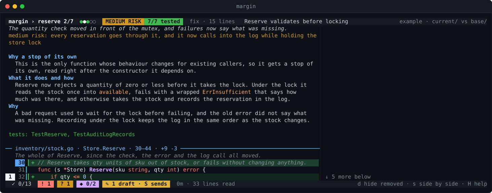

Below the rationale, the stop lists the tests that cover it. Each part is a slice of a file with the
diff marked in the gutter: green `+` lines are the code as it is now, red `-` lines are gone and
have no line number. A changed line shows as the red lines it replaced followed by the green lines
that replaced them, with the words that differ highlighted and struck through on the red side.
Press `d` to hide the red lines and read only the resulting code, or `s` to put the old code on
the left and the new code on the right when the pane is wide enough.
The cell right after the line number shows test coverage: `┃` when a test runs the line, a red
`✗` when the line changed and no test runs it.
Notes sit in the right column next to the line they belong to, numbered in the gutter, so `2+`
means note 2 and more notes on that line. The footer counts reviewed notes, open problems (`!`)
and questions (`?`), and how long and how much you have read.

Notes carry a kind:

| Mark | Kind | Meaning |
| --- | --- | --- |
| `!` | problem | a real issue, backed by evidence (lines, a failing test, a repro) |
| `?` | question | for the author, or a problem the agent could not back up yet |
| `◆` | your call | a judgment only you can make, see below |
| `✓` | looks right | the agent checked this and found it fine |
| `i` | context | something the reader needs to know |
| `·` | nit | minor, never blocking |

A note can also carry a focus area, such as `security` or `breaking-change`, shown in its header.
`F` cycles the filter: all notes, then problems with questions and calls, then problems only, then
one filter per focus area the notes use. The footer names the filter that is on.

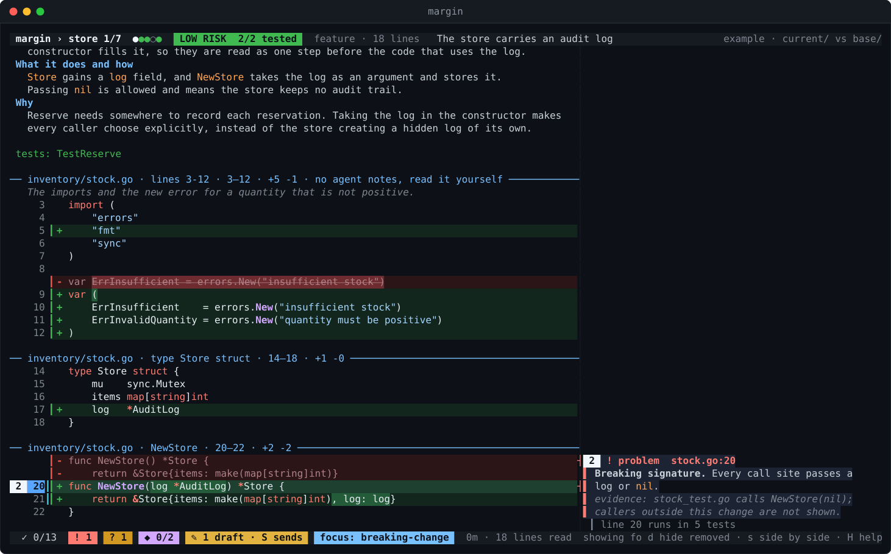

A part without notes says so, which tells you the agent never looked at it, as opposed to having
looked and found it fine. The viewer uses the mouse for scrolling, so text cannot be selected with
a drag; press `y` to copy the selected note instead, or `Y` for the whole stop. Copying uses
`wl-copy`, `xclip` or `xsel` when installed, and otherwise hands the text to tmux. A note marked Δ was changed after the agent edited the code; read it
again.

### Your calls

Some questions no test and no agent can settle: whether a timeout suits your users, whether a
store without a log should still be allowed. The agent leaves those as `◆` calls, phrased as a
question and anchored on the line it depends on, and only where a real judgment is needed. A stop
lists its calls before the code, the recap collects all of them as a checklist, and the footer
counts how many you have made. Press `space` on a call once you have made it.

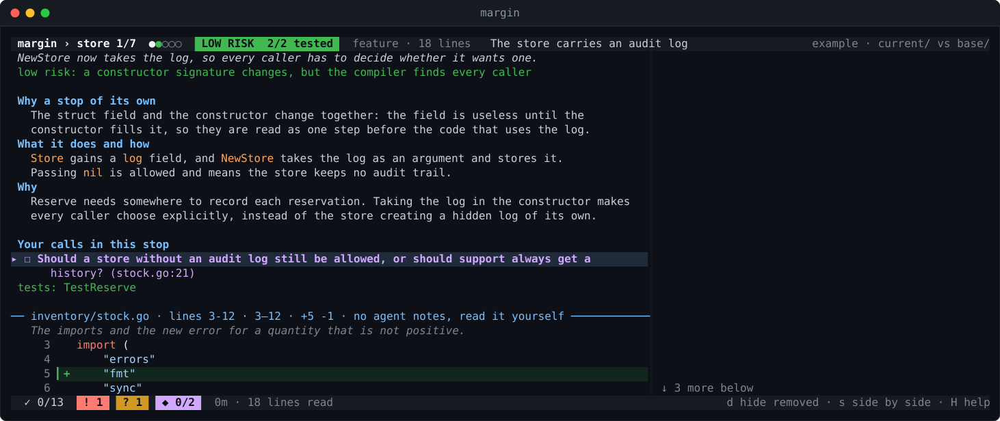

### High-risk stops: read first

On a high-risk stop the notes stay hidden, so the agent's findings do not steer what you notice.
Read the code, then press `v` to compare with what the agent found.


### Asking about a line

Put the cursor on a line and press `a`. Type the question and press `enter` (`esc` cancels). It
arrives in the agent's pane as `[margin q1] file:line in station ...`, the agent answers in chat
and saves the answer as a note on that line, with your question above it. Press `N` to jump to
notes that arrived while you were reading. For "this" or "here", the agent looks up where your
cursor is itself.


To have something changed, type it in the agent's pane. The agent edits the code, marks the notes
it affected with Δ and the review reloads.

### Commenting as you read

`a` interrupts the agent with each question. When you would rather read on and hand over your
remarks in one go, press `c` on a line instead: the comment is kept as a draft, marked `✎` in the
gutter and shown in the notes column. Press `S` to send every draft to the agent in one message.
The agent handles each comment, by changing the code or by explaining why not, and closes it with
`margin resolve`; the answer lands on that line as a note under your comment. The recap lists your
comments with where each stands, and `x` on a draft there deletes it.

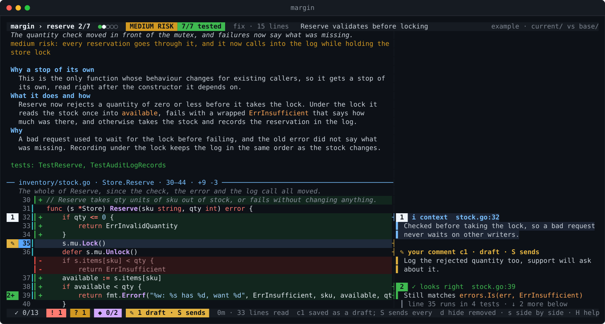

Once the agent has handled a comment, the answer sits on the same line as a note, with your comment
above it in italics, and the comment leaves the list of open ones:

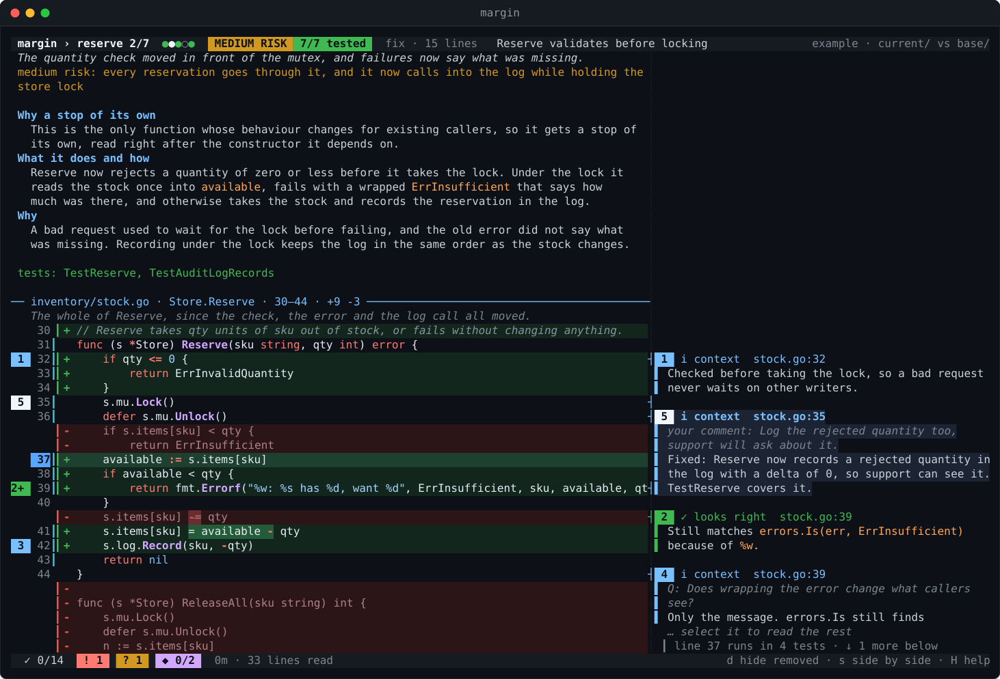

### Jumping between stops

`}` and `{` move one stop forward or back; `tab` opens the list of stops.


### Searching the code

Press `/`, type a word and press `enter`: the cursor jumps to the next code line that contains it,
in this stop or any later one, and wraps around at the end like vim. Every match is highlighted,
and folded code opens when a match is inside it. `n` and `N` go to the next and previous match
while the search is on; `esc` ends it and gives `n` and `N` their usual meaning back. The search
ignores case unless you type a capital letter, and `/` followed by `enter` repeats the last search.

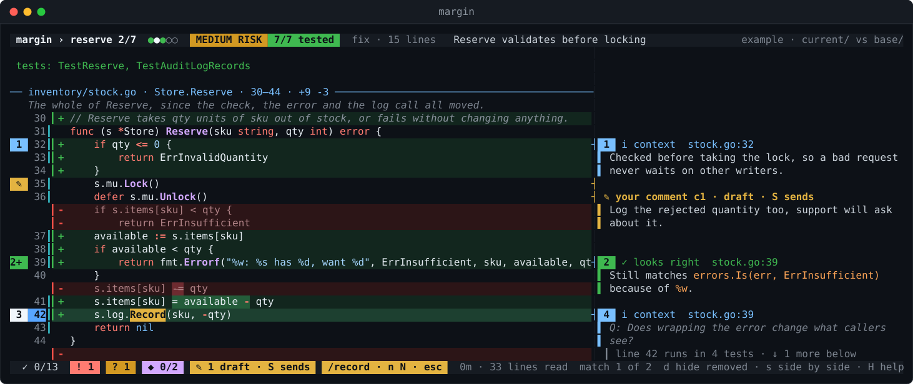

### Nothing left out

Every changed line has to be in a stop, or in the review's list of things safe to skip. When the
agent regroups the tour and a change ends up in no stop, or a file starts changing after the review
was made, margin adds a stop of its own, **Changes no stop shows**, at the end of the tour and
lists it as a problem on the overview and in `margin lint`. Read it there, or ask the agent to place
it.

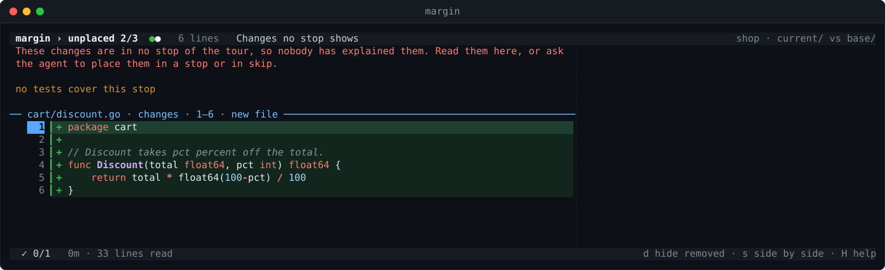

### Moved code

Code that was cut from one place and pasted in another, unchanged apart from its indentation, is
marked `→` where it arrived and `←` where it left, tinted blue instead of green and red. Away from
real changes it folds into a line such as `⋯ 12 lines moved from stock.go, old line 40,
unchanged`, so a move is read once instead of twice. Below, `roundCents` left `cart.go` (`←`) and
arrived as the body of `money.Round` (`→`); the only lines to read are the new name and the call.

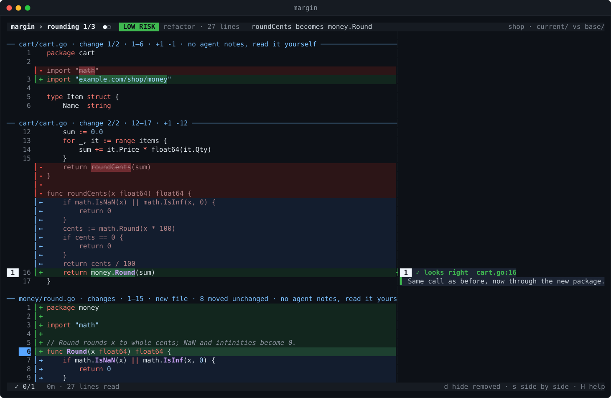

### The recap

The tour ends with the recap, the checklist before you approve: your calls, every problem and open
question, and your comments. Each entry shows the whole note, wrapped to the width of the pane, and
`enter` jumps to it.


## Test coverage

A review is only as good as the tests behind the change, and "the tests pass" does not say whether
any test reaches the lines that changed. Once the agent has measured coverage, margin shows it in
four places, each answering a different question.

### Which changed lines does no test run?

Every code line gets a mark in the cell after its line number:

| Mark | Meaning |
| --- | --- |
| `┃` | at least one test runs this line |
| red `✗` | the line is new or changed, and no test runs it |
| `·` | the line did not change, and no test runs it |
| blank | nothing on the line can run (a comment, a lone bracket), or the file was not measured |

`u` jumps to the next untested changed line in the whole review and `U` to the previous one.
With the cursor on a line, the bottom of the notes column says which tests run it, or that none
does. Here line 15 is the new `continue` for zero deltas, and no test sends a zero delta:

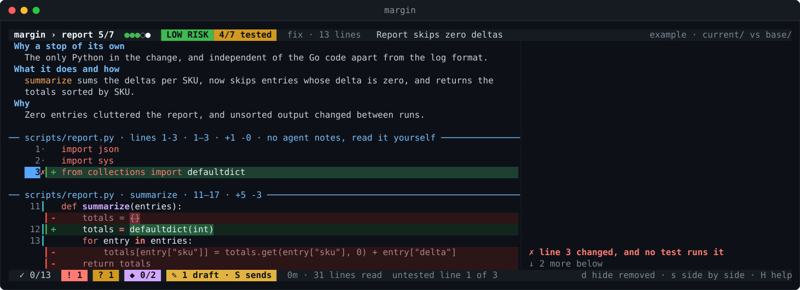

### How well is each stop tested?

The overview gives each stop a bar of its changed lines that a test runs, such as
`tested ███████░░░░░ 4/7 changed lines · 3 untested`: green when every changed line runs, amber
when some do, red when none do. The header of a stop repeats the count (`4/7 tested`). Only changed
lines count, and only lines that can run. A high-risk stop with a short bar is where to read
hardest. You can see the bars in the [overview screenshot](#the-overview) above.

### What does each test exercise?

The Tests stop turns into a grid, with the tests down the side, grouped by package or test file
with subtests indented under their parent, and the stops across the top. Each cell shows how much
of that stop's changed code the test runs:

| Cell | Meaning |
| --- | --- |
| `●` | the test runs every changed line of the stop |
| `◐` | it runs some of them |
| `·` | it runs none of them |
| blank | the stop has no changed lines that can run |

The last row counts, per stop, the changed lines no test runs at all. A test marked `new` was added
by the change. A row of `·` is a test that does not touch this change, and a column without `●` or
`◐` is a stop no test reaches.

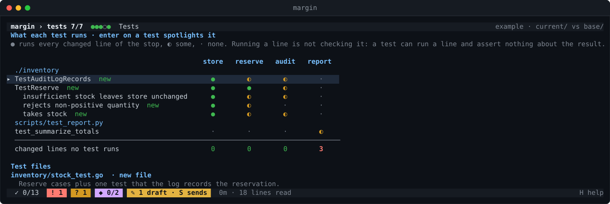

### Which path does one test take through the change?

Press `enter` on a test in the grid to spotlight it. The review jumps to the first changed line
that test runs, and every line the test never reaches is drawn in grey, in every stop, until you
press `esc`. The header names the spotlit test. Below, the test that rejects a non-positive
quantity runs the new check at the top of `Reserve` and returns before anything else:

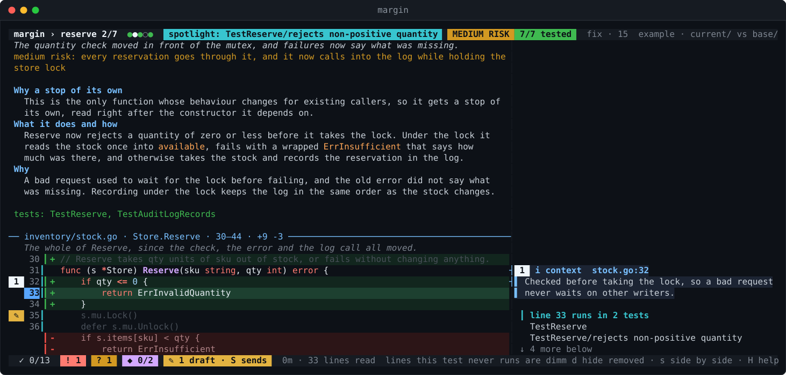

### What coverage does not tell you

Coverage says a test *ran* a line, not that the test checked what the line did: a test can run
every line of a function and assert nothing about its result. The agent is asked to point out
such cases in its notes. Coverage is also tied to the code it was measured on. When a file changes
afterwards, its stops say `coverage stale` and show no marks rather than wrong ones, and the agent
measures again.

### How coverage is measured

margin never runs your tests; the agent does, in its own pane and under its own permissions.

- **Go.** `margin coverage go` writes a short shell script next to the review file. For each
  package with changed files, the script builds the test binary once, lists every test and
  subtest, and runs each one on its own with coverage of all changed packages, so each test's
  lines are known separately. Its last step hands the results to `margin coverage add-go`. The
  agent reads the script and runs it with `sh`. Tests that live in other packages can be added to
  the script by hand.
- **Other languages.** The agent measures per-test coverage with the project's own tool (for
  example pytest with `--cov-context=test`), converts it to this format and passes it to
  `margin coverage add file.json`:

  ```json
  {
    "tests": [
      {"name": "test_summarize_totals", "file": "tests/test_report.py",
       "lines": {"scripts/report.py": [11, 12, 13, 14, 16, 17]}}
    ],
    "executable": {"scripts/report.py": [11, 12, 13, 14, 15, 16, 17]}
  }
  ```

  Line numbers start at 1. `executable` is optional; it separates lines no test ran from lines
  that cannot run at all.

Both commands record a fingerprint of each file, print the changed lines no test runs, and reload
the viewer. Coverage is stored beside the review as `<name>.review.coverage.json`;
`margin coverage clear` removes it.

## Keys

| Key | Action |
| --- | --- |
| `j` `k` / arrows, `ctrl+d` `ctrl+u`, `g` `G` | move |
| `}` `{` | next / previous stop |
| `tab` | list of stops |
| `]` `[` | next / previous note |
| `N` | next note the agent added while you were reading |
| `u` `U` | next / previous changed line that no test runs |
| `enter` on a test in the Tests stop | spotlight it: dim every line it does not run, `esc` ends |
| `/` | search the code in every stop; `n` `N` then jump to the next / previous match, `esc` ends the search |
| `enter` | open the selected link, or unfold |
| `a` | ask about the current line |
| `c` | comment on the current line, kept as a draft |
| `S` | send the draft comments to the agent |
| `space` | mark the note reviewed, or a call made, and move on (again to undo) |
| `?` | flag the note to come back to (again to undo) |
| `x` | dismiss the note as not useful; in the recap, delete a draft comment |
| `y` | copy the selected note to the clipboard, with its file:line |
| `Y` | copy the whole stop: its rationale, part intros and every note, ready to paste into a PR |
| `v` | show the notes on a high-risk stop you read first |
| `F` | filter: all notes, problems with questions and calls, problems only, then each focus area |
| `z` `d` `n` `f` | fold unchanged lines, removed lines, notes column, whole file |
| `s` | side by side: old code left, new code right |
| `h` `l`, `0` | scroll sideways, back to the start |
| `r` | reload |
| `H` | help |
| `q` | quit |

## Posting your review

margin never posts anywhere. `margin export` prints your comments (with the agent's resolution),
the notes you flagged with `?`, and your calls as a checklist, as markdown to paste into a pull
request. `margin export --format github` prints the same as the body of a GitHub review, which you
can post yourself:

```sh
margin export --format github > review.json
gh api repos/OWNER/REPO/pulls/123/reviews --input review.json
```

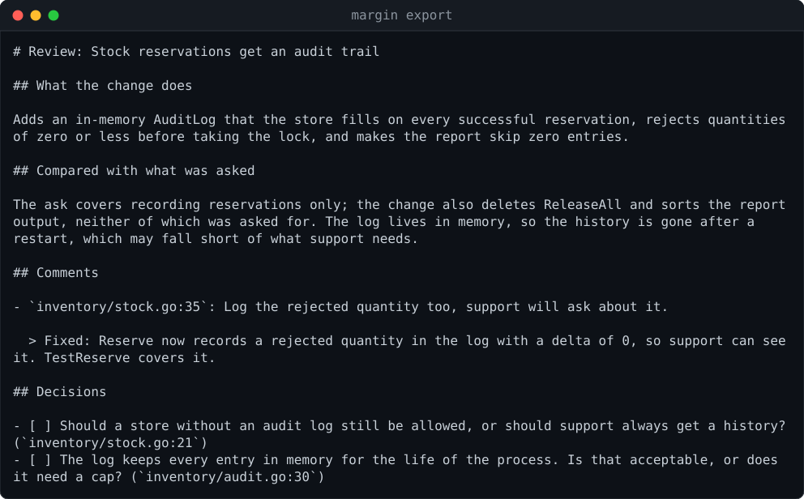

## Repository settings

A repository can keep two files under `.margin/`. margin reads them from the base side of the
review, the commit it compares against, so a change under review cannot rewrite the rules it is
reviewed by.

- `.margin/ignore` lists files that need no stop, one gitignore-style pattern per line (`*.pb.go`,
  `dist/`, `!keep.pb.go`). They are still listed on the overview.
- `.margin/instructions` is review guidance for the agent: conventions, areas that deserve care.
  The agent is told it comes from the repository and is to be used to decide where to look, never
  as instructions to run anything. The overview shows it, together with your own `--instructions`,
  so you can see what the agent was asked to look at.

## For the agent

The agent drives the viewer through the same binary. `margin agent-help` prints its instructions.

```sh
margin note internal/api.go:42 "Validates before the lock, so ..."
margin note internal/api.go:50 --kind decide --focus security "Should ... ?"
margin answer q3 "Because ..."
margin resolve c2 "Fixed: the quantity is logged now."
margin questions               # open questions and sent comments
margin goto api:2              # station "api", note 2
margin goto internal/api.go:42
margin where                   # JSON of what the reader is looking at
margin coverage go             # write a script that measures Go coverage per test
margin coverage add-go DIR     # record the profiles that script collected (it calls this itself)
margin coverage add cov.json   # per-test coverage from any other tool
margin coverage clear          # forget the coverage
```

The review file is plain YAML the agent can also edit to set a summary, `did` and `gap`, regroup
files into stations, write each stop's rationale (`scope`, `what`, `why`), `risk_why` and each
part's `about` line, or add notes anchored by text rather than line numbers, so they survive edits. The agent is asked to
annotate generously, with a note on every changed block rather than only on problems. A
hand-written example is in [`testdata/example`](testdata/example/example.review.yaml) and opens
with `margin open testdata/example/example.review.yaml`.

## Safety

margin is meant for reading code you did not write, so it treats the repository as untrusted.
It never writes to the repository and never executes anything from it; git is only used through
read-only plumbing with refs passed after `--end-of-options`. `--pr` only reads a pull request
through `gh` and never fetches or posts. Terminal escape sequences and bidi controls are stripped
before rendering, and questions are never typed into a pane that runs a plain shell. Commit
messages, pull request descriptions and `.margin/instructions` are written by other people, so they
reach the agent marked as such, and the instructions only from the base side. What the agent does in its own pane is up to the agent and its permissions; that
includes running tests for coverage, which margin only reads.

## Development

`go test ./...` runs the tests; one of them builds and runs a small Go module to check the coverage
script end to end (`-short` skips it). `sh docs/screenshots/shoot.sh` regenerates the screenshots
from the example review, in a private tmux server so it does not touch your own sessions.

## Roadmap

- Light theme
- Word-level highlighting inside changed lines
- Faster loading of large diffs (`git cat-file --batch`)
- Picking up files that start changing while a review is open
- `margin html` export

## License

MIT
