# margin

margin reviews git changes in the terminal with a coding agent beside you. Run it inside a
repository and the changed code opens next to the agent, with the diff drawn in the gutter and the
agent's comments beside each change, so you can ask about a line, ask for a fix, or ask for more
detail and see the answer land in the review.

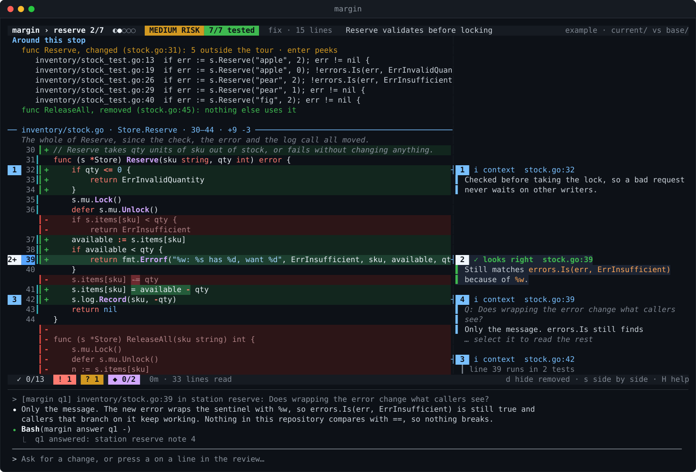

The review sits on top and a fresh agent below, inside a private tmux server attached to a single
pane, so whatever surrounds it only sees one pane. Inside [gw](https://github.com/redrick/gw) that
pane is a new sub-window of the current worktree; in plain tmux margin splits the current pane;
outside tmux it takes over the terminal. Running `margin` again for the same review reattaches it.

```sh
margin              # review uncommitted changes
margin --staged     # review only what is staged
margin feature-x    # review a branch against the main branch
margin a1b2c3d      # review one commit
margin --pr 123     # review a GitHub pull request (read-only)
```

> Status: early, but the whole loop works. See the roadmap below. New to it? Jump to
> [How to use it, really](#how-to-use-it-really): margin walks you through the review one step at
> a time.

**Contents:** [Install](#install) · [How a review goes](#how-a-review-goes) ·
[How to use it, really](#how-to-use-it-really) (the guided walk,
[in pictures](#the-guided-walk-in-pictures)) · [A walk through the viewer](#a-walk-through-the-viewer) ·
[Answering the agent's questions](#answering-the-agents-questions) · [Test coverage](#test-coverage) ·
[Keys](#keys) · [Posting your review](#posting-your-review) · [Repository settings](#repository-settings) ·
[For the agent](#for-the-agent) · [Safety](#safety)

## Install

Requires Go 1.24 or newer, git and tmux. The agent defaults to
[Claude Code](https://docs.claude.com/en/docs/claude-code) (`claude`); any CLI agent that accepts
an initial prompt works via `MARGIN_AGENT`.

```sh
go install github.com/redrick/margin/cmd/margin@latest
```

To try the viewer without a real change, open the hand-written example:

```sh
margin open testdata/example/example.review.yaml
```

## How a review goes

1. `margin` works out what changed and writes a review file with one station per changed file,
   each showing every changed region with a few lines of context. It also records what the change
   was meant to do, from the commit messages, the pull request description or `--intent`. The
   viewer shows it at once.
2. The agent starts with instructions to shape the tour first: it compares the change with what
   was asked, groups related files into 3 to 6 stops, orders them so each needs only the ones
   before it (riskier first where they do not depend on each other), says why each stop comes
   where it does and why it is risky, and writes a summary. Every change has to land in a stop or in the list of things safe to
   skip. Then it comments on every change: why it is there and whether it looks correct. Its notes
   appear beside the code as it writes them.
3. The agent measures which tests run which changed lines (see [Test coverage](#test-coverage)),
   so the gutter shows untested code and the Tests stop shows what each test exercises.
4. You read with the keys below. Press `a` on a line to ask about it; the question is typed into
   the agent's pane, and the agent records its answer as a note on that line.
5. Ask the agent for a code change in its pane. It edits the code, measures coverage again and
   the review reloads.

Reviews live outside the repository, so running `margin` again resumes where you left off,
including what you marked as reviewed. The directory is `$MARGIN_DIR` if set; otherwise, if Claude
Code has an `obsidian-memory` skill that declares a `**Vault root:**`, reviews go into that vault
as `<project>/topics/<branch or commit>/`; otherwise `~/.local/state/margin`.

Options:

| Option | What it does |
| --- | --- |
| `--base REF` | compare against another ref |
| `--staged` | review the index instead of the working tree |
| `--pr N` or `--pr URL` | review a GitHub pull request, see [Pull requests](#pull-requests) |
| `--intent "..."` | say what the change was meant to do, when the commit messages do not |
| `--instructions "..."` | tell the agent what to pay attention to in this review |
| `--fresh` | start the review over |
| `--no-agent` | open only the viewer |

The two panes share one tmux window with the mouse enabled, so click a pane to move between the
review and the agent.

### Pull requests

`margin --pr 123` (or the pull request's URL) asks the GitHub CLI `gh` for the pull request's
title, description, base branch and head commit, and reviews the head against its merge base with
the base branch. margin only reads from GitHub and never fetches, so the head commit has to be in
your repository already; if it is not, margin prints the `git fetch` to run. The description
becomes what the change was asked to do.

## How to use it, really

margin walks you through a review in three phases, always in the same order, and the top line
always says where you are: **① Orient**, **② Walk**, **③ Decide**. You need four keys: `space` to go
on, `b` to go back, `c` to comment, `a` to ask. `H` lists the rest, and `e` shows more text wherever
the screen keeps it short.

**1. Start it where the change is.**

```sh
margin                            # your own uncommitted work, before you commit it
margin --staged                   # only what you have staged
margin feature-x                  # a branch, against main
margin --pr 123                   # someone's pull request (git fetch origin pull/123/head first)
margin --intent "Support needs a history of stock changes"   # when the commits do not say why
```

Add `--instructions "check the migration is reversible"` when you already know what worries you.

**2. Orient: one screen, one question.** The review opens on a single screen: what the change is
*for* (from the commits, the pull request or `--intent`), what it *does*, and the *gap* between the
two when there is one. Below that is the route: the stops in the order you will read them, each
with a few words on why it comes there ("the errors every later stop returns", "uses the resolver
from stop 1"). For the first minute or two the agent shapes the route and the screen fills in.

Then it asks one question before any code: **does this change make sense, done this way?** `y`
walks it. `?` walks it too, when you are not sure yet. `n` asks you why, and that answer is the
review: it blocks the change and takes you straight to the decision, because details do not matter
when the approach is wrong. `e` shows everything the agent wrote about the whole change.

**3. Walk: each stop, one step at a time.** Each stop opens with a card of a few lines: what it is,
its risk, why it comes now, and the one thing to **check**. Then:

- **Know this first** (only where needed) shows unchanged code the change leans on. There is nothing
  to judge in it.
- **One change per step.** A step is one reading unit: the edits of one function, or close together,
  shown with a little context and the agent's notes beside their lines (`]` `[` step through them).
  Every step ends with the question to answer before going on, and `space` means "yes, go on".
- **Settle here.** Whatever a note asks of you is settled on the step it belongs to, in a short list
  under the code (`j` moves down to it): `enter` ticks a `◆` call once you have made it, `?` agrees
  with a `!` problem and `x` dismisses it, and `enter` on a `?` question from the agent opens a
  comment that answers it.
- **Callers.** If a function the step changes is called from a few places outside the review, the
  step lists them; `enter` peeks at the code around one.
- **On any line** of the change: `t` lists the tests that run it, `c` comments, `a` asks the agent,
  and `enter` on a line with notes opens them all at full length.
- **Housekeeping.** Import edits need no judgment, so they come together in one step at the end of
  the stop, to glance over.
- **Your verdict.** The last step lists the checks as a reminder and whatever is still open, then asks
  one question: `1` looks good, `2` needs changes, `3` not sure yet. "Not sure" is a fine answer: go
  back with `b` and ask about the line that bothers you.

`space` after the verdict moves on to the next stop. Moving past a change counts its notes as read, so
there is nothing to tick off by hand. The walk is a suggestion, not a cage: `tab` lists the stops and
`}` `{` jump between them.

**4. Write comments the author can act on.** `c` first asks what kind of comment it is, after
[Conventional Comments](https://conventionalcomments.org/): `i` issue, `s` suggestion, `q`
question, `n` nitpick, `p` praise, `t` thought. An issue blocks the change and the rest do not; `!`
flips that. While you type, the prompt says what a good comment of that kind contains ("what goes
wrong, for which input, and what you would do instead"). Comments stay drafts until `S` sends them all
to the agent, which fixes the code or explains why not and closes each one. The review reloads by
itself: `N` jumps to the new notes, and notes marked Δ changed along with the code.

**5. Decide: the recap tells you what to do.** After the last stop, the recap recommends *approve*, *request
changes*, or says the review is *not finished* and lists exactly what is left: stops without a
verdict, calls not made, problems neither flagged nor dismissed, blocking comments not resolved.

**6. Post it.** `margin export` prints the recommendation, your comments with the agent's answers,
the notes you flagged and your calls, ready to paste into the pull request. `margin export --format
github` prints a review for `gh api` with the matching event (approve, request changes or comment).
margin never posts on its own.

**7. Stop any time.** Press `q`. Running the same `margin` command later reopens the review where
you left it, with your verdicts, marks, comments and the agent's notes.

Prefer to see a whole stop at once? `w` switches to the whole-stop view described in [A walk through
the viewer](#a-walk-through-the-viewer), with the notes in a column beside the code, and remembers the
choice. `w` again switches back. `margin open --full` starts in it.

The footer tracks how long and how much you have read, because review quality drops after roughly
400 lines or 90 minutes. Take a break there; `margin` resumes where you stopped.

### The guided walk in pictures

Every screen of the walk, in the order you meet it. The second line of the screen always says
where you are: the phase, the stop, the step, and what kind of step it is.

**① Orient.** What the change is for, what it does, the route, and the one question before any
code. `y` walks it, `?` walks it while you are unsure, `n` asks why and goes straight to the
decision.

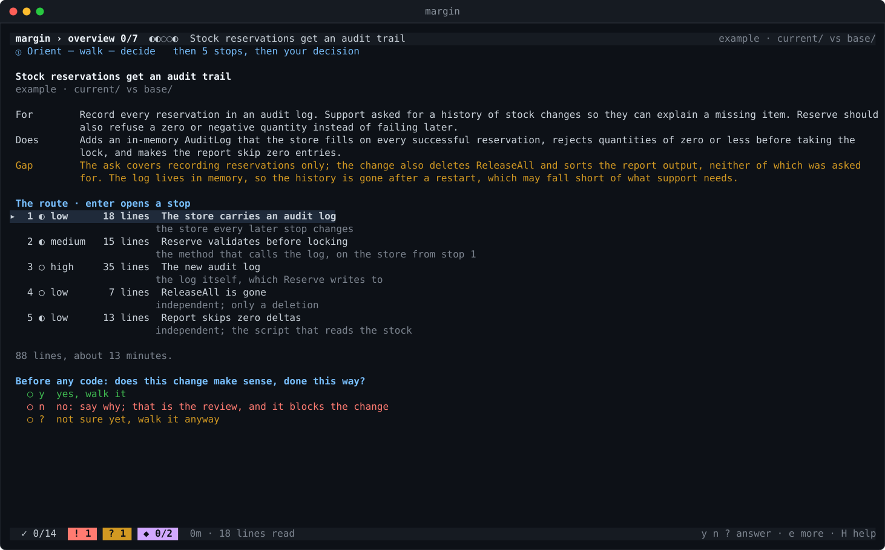

**The card of a stop.** What it is, its risk, why it comes now and the one thing to check. `e` adds
what and why, the flow and the before/after examples. `space` starts reading.

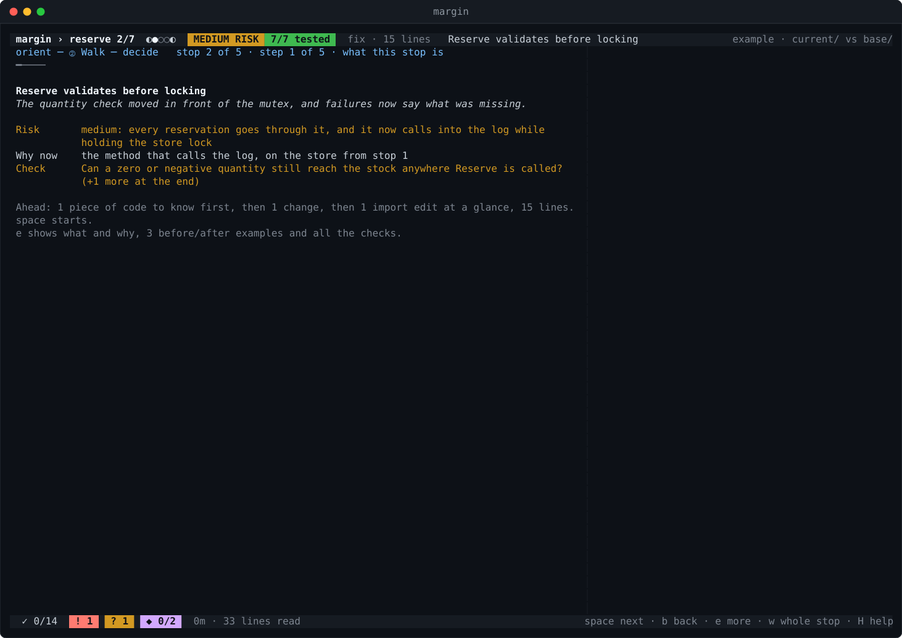

**Know this first.** Unchanged code the change leans on, dimmed and marked `┊`. Only there when the
agent thought you need it; there is nothing to judge in it.

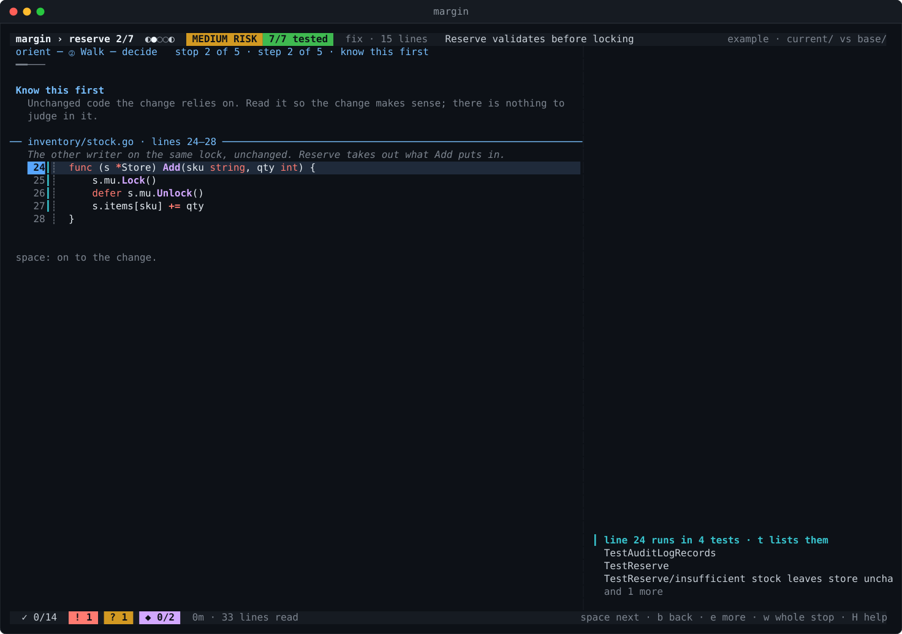

**One change.** The agent's notes sit beside the lines they are about, numbered in the gutter. The
question under the code is the one to answer before `space`.

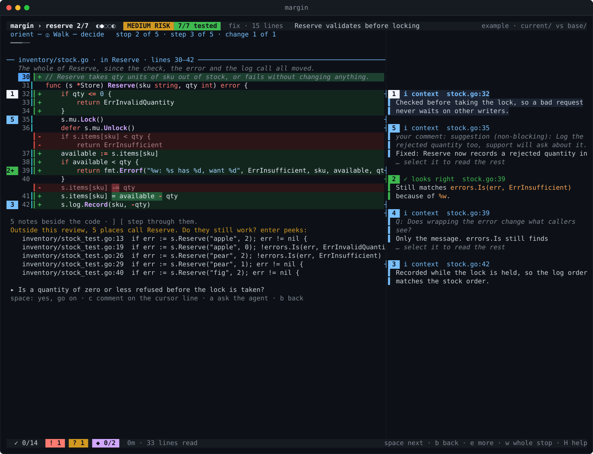

**Settle here.** When a note on the step needs something from you, it is listed under the code.
Here the agent asks a question only the author can answer:

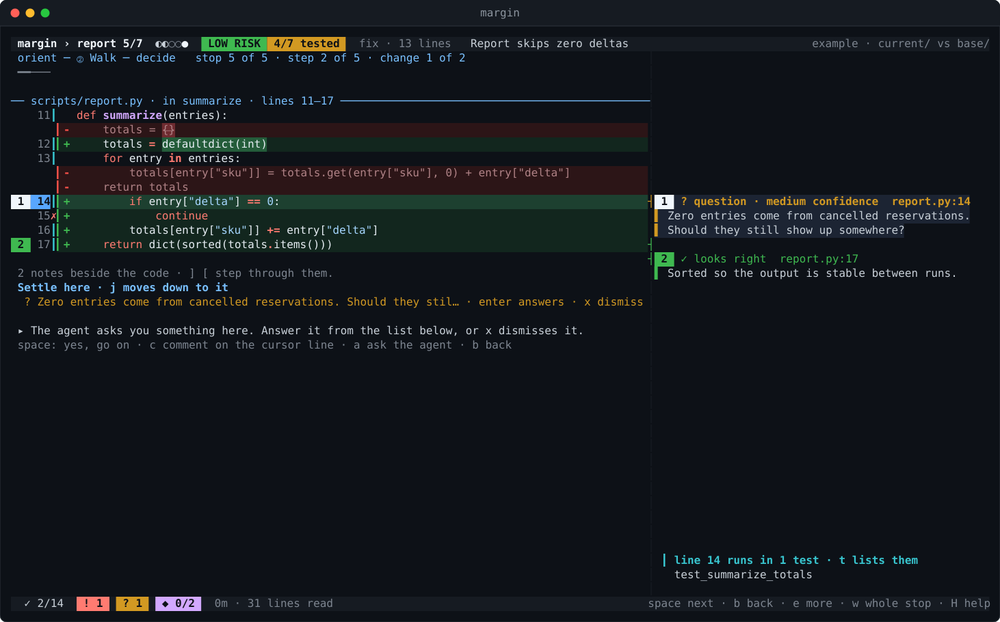

`enter` on it opens a comment tied to the question and anchored on its line. It is kept as a draft
and goes out with your other comments on `S`:

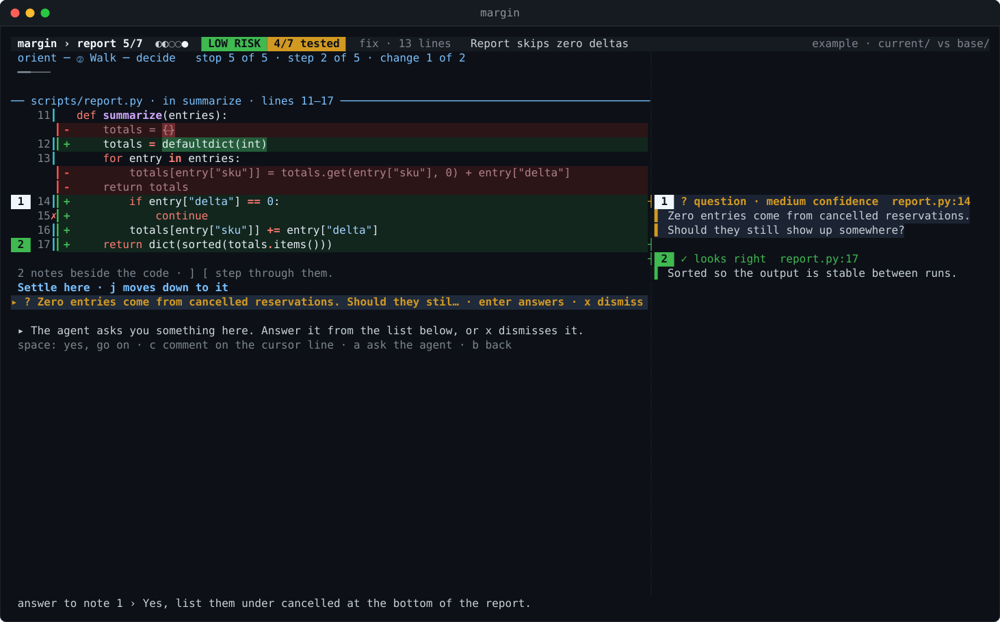

**Commenting.** `c` on any line first asks what kind of comment you are writing, then shows what a
good comment of that kind says while you type.

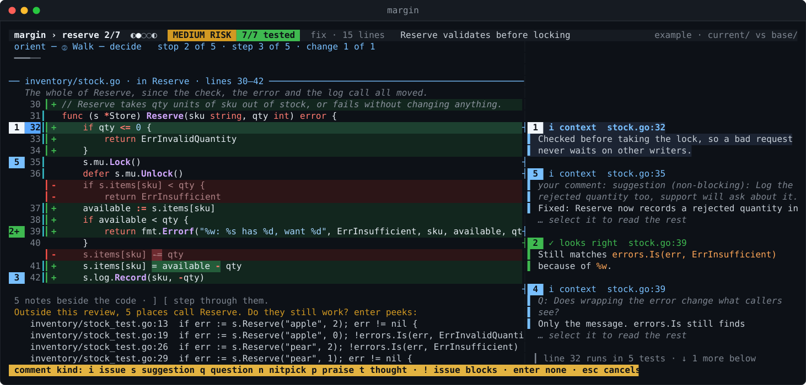

**Housekeeping.** Import edits that follow from the changes, together in one step at the end of the
stop. Glance over them.

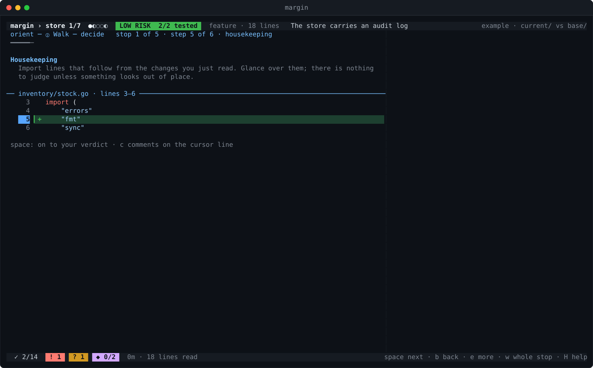

**End of the stop.** The checks as a reminder, whatever is still open (calls not made, problems not
settled, questions not answered), your comments on the stop, and the verdict: `1` looks good, `2`
needs changes, `3` not sure yet. `space` then moves on to the next stop.

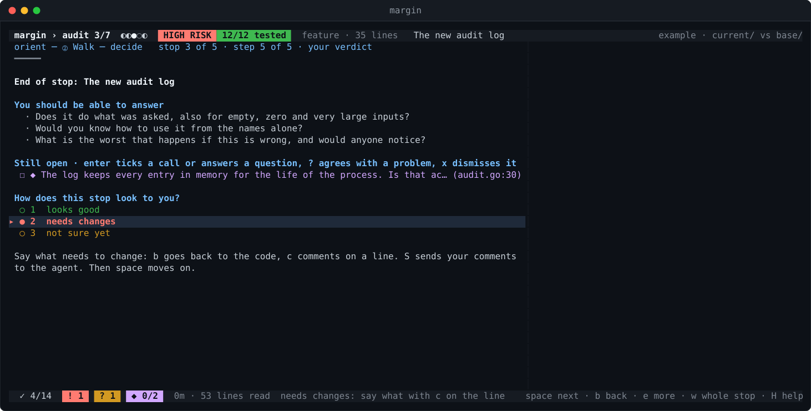

**③ Decide.** The recap turns your verdicts into a recommendation and says what is left; `enter`
on any entry jumps back to it.

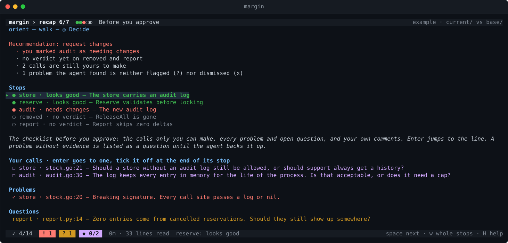

### Why it works this way

- Orient, then the main part, then the rest: [Google's guide to navigating a change](https://google.github.io/eng-practices/review/reviewer/navigate.html)
  first asks whether the change makes sense at all, and sends design comments before any detail,
  because the rest may not survive them.
- Few, coarse steps rather than a long checklist: a strictly guided, step-by-step checklist helped on
  a small change but got in the way on large ones ([Gonçalves et al., 2022](https://dl.acm.org/doi/abs/10.1007/s10664-022-10123-8)),
  so each step is a whole reading unit, mechanical edits share one step, and long texts wait behind `e`.
- The order is shown and explained: reviewers get lost in an order they cannot follow, and prefer
  reading what is used before what uses it ([Baum et al., 2017](https://sback.it/publications/icsme2017.pdf)),
  so stops come in dependency order and the route says why each one comes where it does.
- One change at a time, related changes next to each other: reviewers keep only a few change parts
  in mind at once, and find more defects when the order follows the code's relations rather than
  file names ([Baum et al., 2019](https://link.springer.com/article/10.1007/s10664-018-9676-8)).
- A step-by-step tour with an explanation at every step is how
  [CodeTour](https://github.com/microsoft/codetour) walks people into unfamiliar code.
- Risky parts early: what a reviewer reads last gets fewer comments ([Fregnan et al., 2022](https://arxiv.org/abs/2208.04259)),
  so among stops that do not depend on each other, the riskier one comes first.
- The checks default to what [Google's review guide](https://google.github.io/eng-practices/review/reviewer/looking-for.html)
  asks per kind of change, until the agent writes ones for the stop.
- Comment kinds follow [Conventional Comments](https://conventionalcomments.org/), so the author
  knows what is a request and what is a thought.

### Making a repository margin-friendly

Two optional files under `.margin/` pay off on repositories you review often: `ignore` for
generated files that need no stop, and `instructions` for what reviewers should always check. See
[Repository settings](#repository-settings).

## A walk through the viewer

This part shows the whole-stop view (`w`, or `margin open --full`): each stop drawn at once, with
the agent's notes in a column beside the code. Everything in it also exists in the guided walk,
spread over the steps.

### What was asked, and what was done

A change can only be judged against what it was meant to do, so stop 0 opens with that:

- **In plain words**: optionally, one sentence on what bothered someone and one on what is better
  now, written for someone in their first week.
- **Asked**: what the change was meant to do, taken from the commit messages, the pull request
  description or `--intent`. margin writes this; the agent does not edit it.
- **Did**: what the change actually does, in the agent's words.
- **Gap**: where the change does more, less or something other than asked. It is amber when there
  is a gap and green when the agent found none.

When nothing says what the change was for, the overview says so instead of guessing.

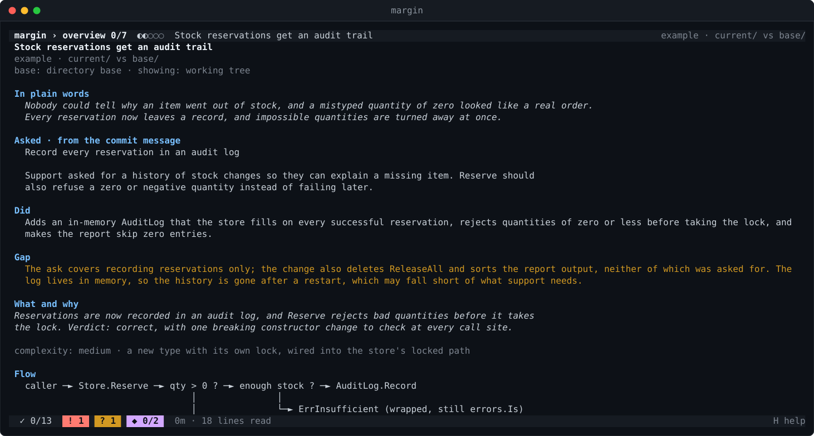

### The overview

Below that come the agent's summary and verdict, how complex the change is, an optional flow
diagram, and the tour. Each stop shows its risk and why it has that risk, what kind of change it
is, how many lines it covers, its problems, questions and calls, how many notes you have marked,
and which tests cover it. Once coverage is measured, each stop also gets a bar of how many of its
changed lines a test runs. The last line estimates how long the rest will take to read. Press
`enter` on a stop to open it.

Further down, **Focus areas** lists the notes the agent tagged as security, breaking change, data
integrity, concurrency, performance and so on, and `F` filters the notes by them. Files left out
by the repository's `.margin/ignore` and files that cannot be shown as text, such as images, are
listed at the end, so nothing that changed goes unmentioned.

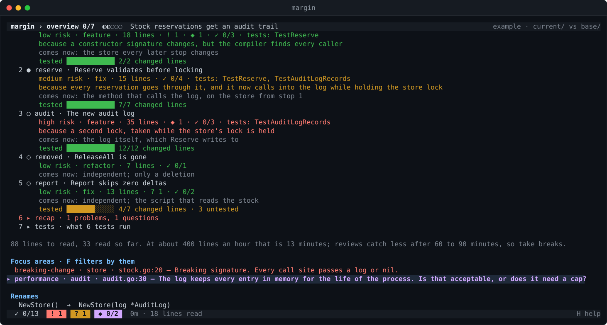

### Reading a stop

The header shows where you are (`reserve 2/7`), the risk and the stop's title; the line below it
says what the stop is about, and the next one why the stop has its risk. Risk means how bad it
would be to miss a problem here, not how likely a bug is.

Before any code, the stop explains itself in three short paragraphs written by the agent:

- **Why a stop of its own**: what ties these parts together, and why they are not read with a
  neighbouring stop.
- **What it does and how**: what the code does, step by step, in the order you meet it below.
- **Why**: why it changed, and why it is built this way rather than the obvious alternative.

Each part (a slice of one file) can add one sentence under its header on what it shows and why it
is in this stop. A stop the agent has not explained yet says `no rationale yet`, so a missing
explanation never looks like a deliberate one.

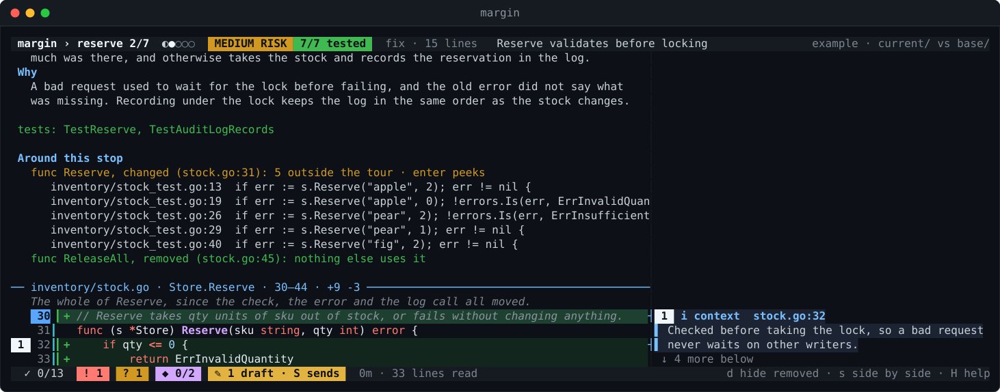

Below the rationale, the stop lists the tests that cover it. Each part is a slice of a file with the
diff marked in the gutter: green `+` lines are the code as it is now, red `-` lines are gone and
have no line number. A changed line shows as the red lines it replaced followed by the green lines
that replaced them, with the words that differ highlighted and struck through on the red side.
Press `d` to hide the red lines and read only the resulting code, or `s` to put the old code on
the left and the new code on the right when the pane is wide enough.
The cell right after the line number shows test coverage: `┃` when a test runs the line, a red
`✗` when the line changed and no test runs it.
Notes sit in the right column next to the line they belong to, numbered in the gutter, so `2+`
means note 2 and more notes on that line. The footer counts reviewed notes, open problems (`!`)
and questions (`?`), and how long and how much you have read.

Notes carry a kind:

| Mark | Kind | Meaning |
| --- | --- | --- |
| `!` | problem | a real issue, backed by evidence (lines, a failing test, a repro) |
| `?` | question | for the author, or a problem the agent could not back up yet |
| `◆` | your call | a judgment only you can make, see below |
| `✓` | looks right | the agent checked this and found it fine |
| `i` | context | something the reader needs to know |
| `·` | nit | minor, never blocking |

A note can also carry a focus area, such as `security` or `breaking-change`, shown in its header.
`F` cycles the filter: all notes, then problems with questions and calls, then problems only, then
one filter per focus area the notes use. The footer names the filter that is on.

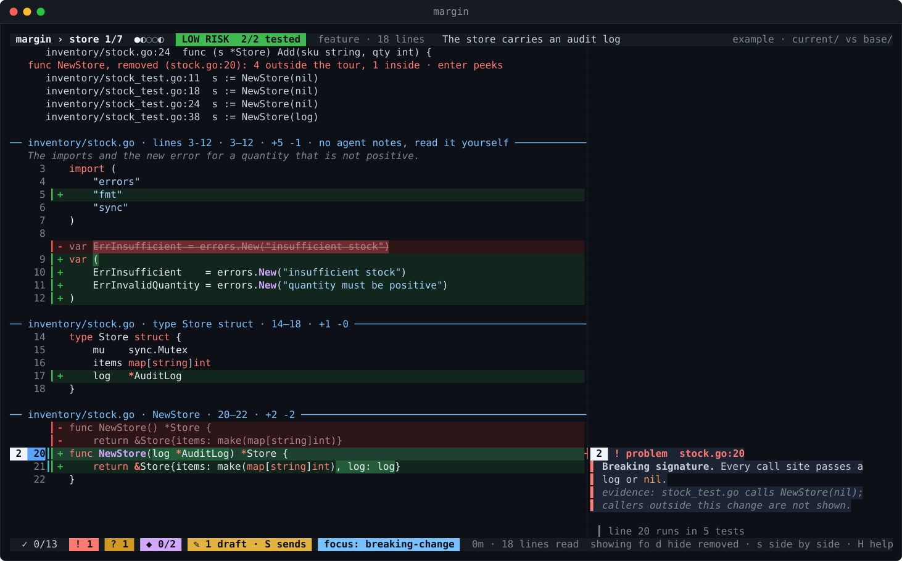

A card too tall for the column ends in `… select it to read the rest` or `… enter reads it all`:
`enter` on its line opens every note on that line at full length, drawn the same as in the column
(kind, colour, question, evidence), in an overlay that scrolls with `j` `k` when it is long. Any
other key closes it.

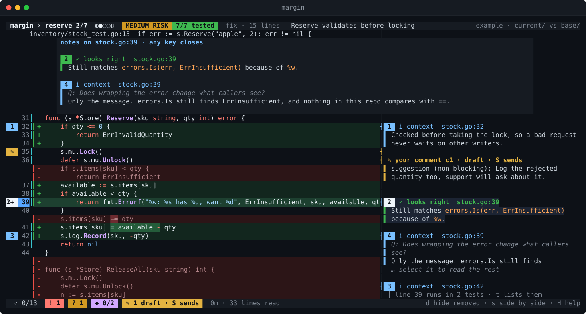

A part without notes says so, which tells you the agent never looked at it, as opposed to having
looked and found it fine. The viewer uses the mouse for scrolling, so text cannot be selected with
a drag; press `y` to copy the selected note instead, or `Y` for the whole stop. Copying uses
`wl-copy`, `xclip` or `xsel` when installed, and otherwise hands the text to tmux. A note marked Δ was changed after the agent edited the code; read it
again.

### Around a stop: examples, callers and history

Most of getting lost in a pull request comes from what the diff does not show: what the code did
before, who else depends on it, and why the old code was written that way. Each stop answers those
three before its code.

- **Before and after** is written by the agent, which runs the old and the new code on a few
  telling inputs, edge cases first. Red is what the old code did, green what the new code does;
  `same` marks an input whose result did not change. Below, the first row shows a bug the change
  fixes that the rationale did not mention: a negative quantity used to add stock.
- **Around this stop** is computed by margin itself when you open the stop. For every function or
  type the stop changes or removes, it lists the places outside the tour that use it. Those are the
  callers whose behaviour may change without the diff showing it. A removed function nobody uses
  says so in green. For a review of commits it also lists the commits that wrote the replaced lines,
  so you can see what the old code was for before judging the new one. A name used in too many
  places to be useful is counted, not listed.
- **Background parts** are unchanged code the agent put in front of the change because you need it
  first. They are dimmed, marked `┊`, say `background, read first` in their header, and do not
  count as lines to review.

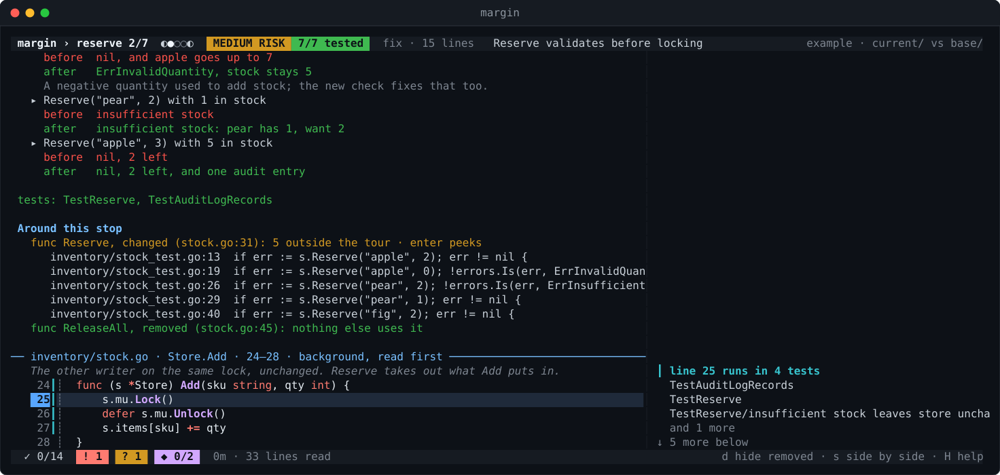

`enter` on a caller opens the code around it in an overlay, and any key closes it, so checking a
caller does not lose your place in the stop.

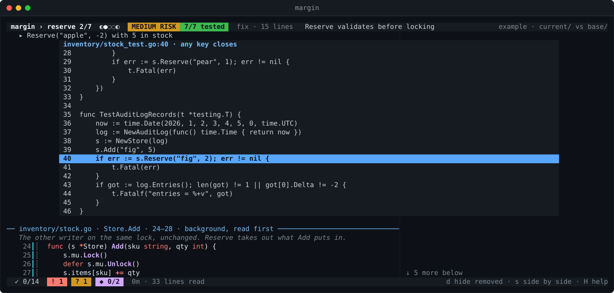

Callers are found by name with `git grep` over the reviewed side (functions by their call, types
by any mention), which is quick and works for any language margin recognises (Go, Python,
JavaScript and TypeScript, Rust, Ruby, PHP). Being text search, it can list a same-named function
from elsewhere and miss calls through an interface or a function value. Treat the list as the
places to check, not as proof of who is affected.

### Your calls

Some questions no test and no agent can settle: whether a timeout suits your users, whether a
store without a log should still be allowed. The agent leaves those as `◆` calls, phrased as a
question and anchored on the line it depends on, and only where a real judgment is needed. A stop
lists its calls before the code, the recap collects all of them as a checklist, and the footer
counts how many you have made. Press `space` on a call once you have made it.

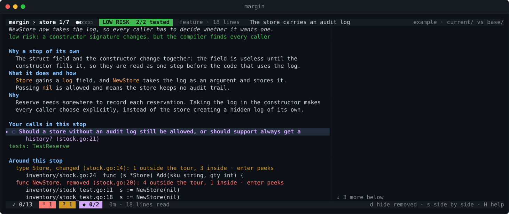

### Blind mode: read high-risk stops first

`margin open --blind` hides the notes on high-risk stops, so the agent's findings do not steer what
you notice. Read the code, then press `v` to compare with what the agent found. The review remembers
the setting. It is off by default, because it takes the help away where the code is hardest.

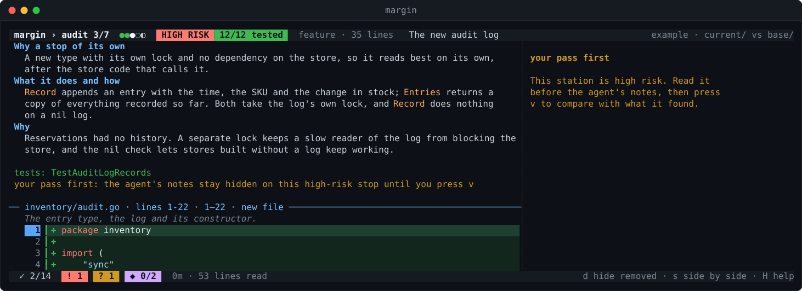

### Asking about a line

Put the cursor on a line and press `a`. Type the question and press `enter` (`esc` cancels). It
arrives in the agent's pane as `[margin q1] file:line in station ...`, the agent answers in chat
and saves the answer as a note on that line, with your question above it. Press `N` to jump to
notes that arrived while you were reading. For "this" or "here", the agent looks up where your
cursor is itself.

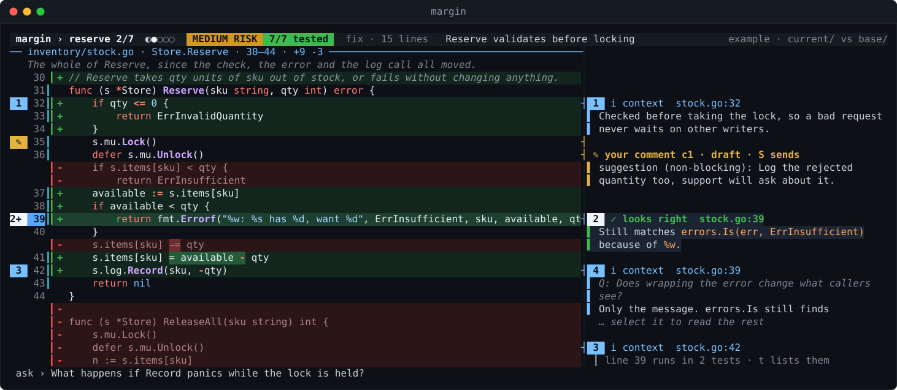

To have something changed, type it in the agent's pane. The agent edits the code, marks the notes
it affected with Δ and the review reloads.

### Commenting as you read

`a` interrupts the agent with each question. When you would rather read on and hand over your
remarks in one go, press `c` on a line instead. margin first asks what kind of comment it is
(issue, suggestion, question, nitpick, praise or thought; `!` flips whether it blocks), then shows
what a good comment of that kind says while you type. The comment is kept as a draft, marked `✎` in
the gutter and shown in the notes column. Press `S` to send every draft to the agent in one message.
The agent handles each comment, by changing the code or by explaining why not, and closes it with
`margin resolve`; the answer lands on that line as a note under your comment. The recap lists your
comments with where each stands, and `x` on a draft there deletes it.

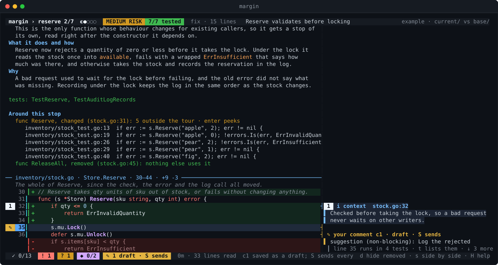

Once the agent has handled a comment, the answer sits on the same line as a note, with your comment
above it in italics, and the comment leaves the list of open ones:

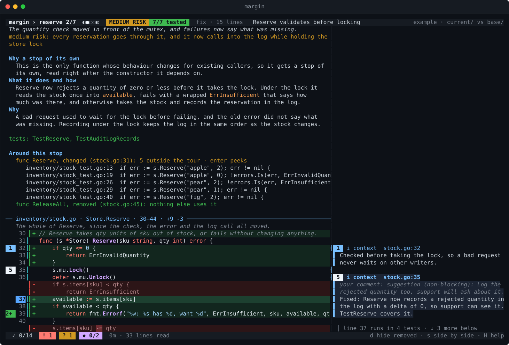

### Answering the agent's questions

A `?` note is the agent asking you, usually something only the author knows. In the guided walk the
step lists it under **Settle here**, and the end of the stop under **Still open**, as
`? <question> · enter answers · x dismiss`. `enter` opens a comment already tied to the question and
anchored on its line; it is kept as a draft and goes out with the others on `S`. The row then shows
`✓ answered`, and the question leaves the stop's open list. `x` dismisses a question that does not
matter.

### Jumping between stops

`}` and `{` move one stop forward or back; `tab` opens the list of stops.

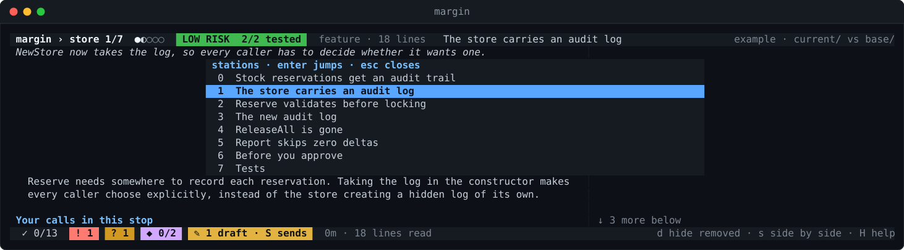

### Searching the code

Press `/`, type a word and press `enter`: the cursor jumps to the next code line that contains it,
in this stop or any later one, and wraps around at the end like vim. Every match is highlighted,
and folded code opens when a match is inside it. `n` and `N` go to the next and previous match
while the search is on; `esc` ends it and gives `n` and `N` their usual meaning back. The search
ignores case unless you type a capital letter, and `/` followed by `enter` repeats the last search.

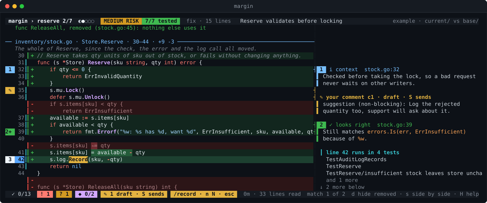

### Nothing left out

Every changed line has to be in a stop, or in the review's list of things safe to skip. When the
agent regroups the tour and a change ends up in no stop, or a file starts changing after the review
was made, margin adds a stop of its own, **Changes no stop shows**, at the end of the tour and
lists it as a problem on the overview and in `margin lint`. Read it there, or ask the agent to place
it.

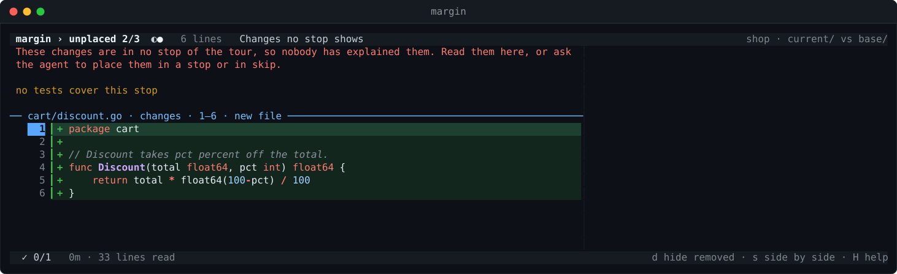

### Moved code

Code that was cut from one place and pasted in another, unchanged apart from its indentation, is
marked `→` where it arrived and `←` where it left, tinted blue instead of green and red. Away from
real changes it folds into a line such as `⋯ 12 lines moved from stock.go, old line 40,
unchanged`, so a move is read once instead of twice. Below, `roundCents` left `cart.go` (`←`) and
arrived as the body of `money.Round` (`→`); the only lines to read are the new name and the call.

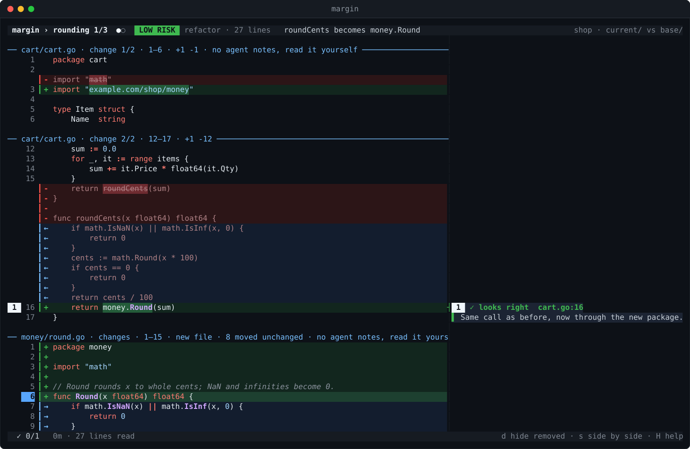

### The recap

The tour ends with the recap, the checklist before you approve: your calls, every problem and open
question, and your comments. Each entry shows the whole note, wrapped to the width of the pane, and
`enter` jumps to it.

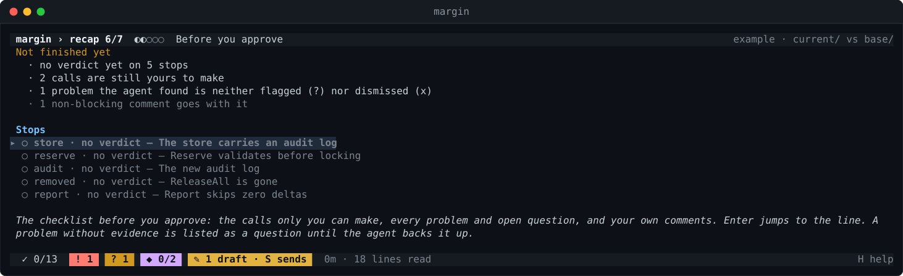

## Test coverage

A review is only as good as the tests behind the change, and "the tests pass" does not say whether
any test reaches the lines that changed. Once the agent has measured coverage, margin shows it in
four places, each answering a different question.

### Which changed lines does no test run?

Every code line gets a mark in the cell after its line number:

| Mark | Meaning |
| --- | --- |
| `┃` | at least one test runs this line |
| red `✗` | the line is new or changed, and no test runs it |
| `·` | the line did not change, and no test runs it |
| blank | nothing on the line can run (a comment, a lone bracket), or the file was not measured |

`u` jumps to the next untested changed line in the whole review and `U` to the previous one.
With the cursor on a line, the bottom of the notes column says which tests run it, or that none
does. Here line 15 is the new `continue` for zero deltas, and no test sends a zero delta:

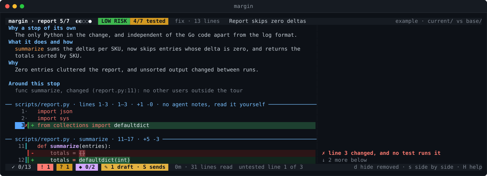

### Which tests, and what do they check?

Press `t` on a line to list every test that runs it, with where each one is defined. The notes
column says how many there are (`line 39 runs in 2 tests · t lists them`).

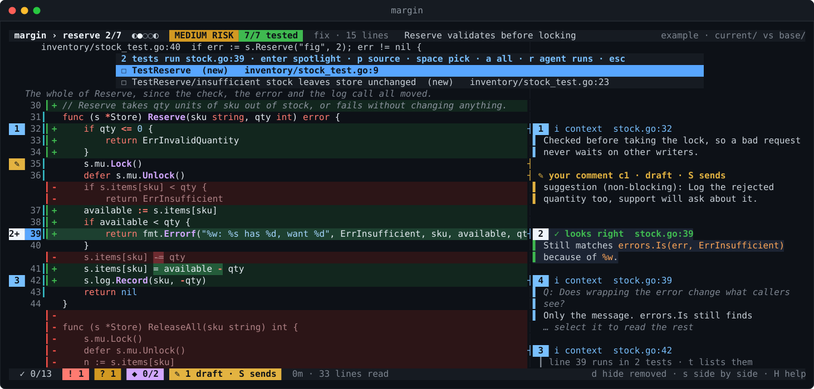

| Key in the list | What it does |
| --- | --- |
| `j` `k` | move |
| `enter` | spotlight the test (see below): the review jumps to the first line it runs and dims the rest |
| `p` | open the test's source in an overlay, on the line where it is defined; for a subtest, on its `t.Run` |
| `space`, `a` | pick a test, pick all |
| `r` | have the agent run the picked tests, or the selected one |
| `esc` `q` `t` | close the list |

`p` shows the test itself, so you can see what it asserts, and closing the source brings the list
back:

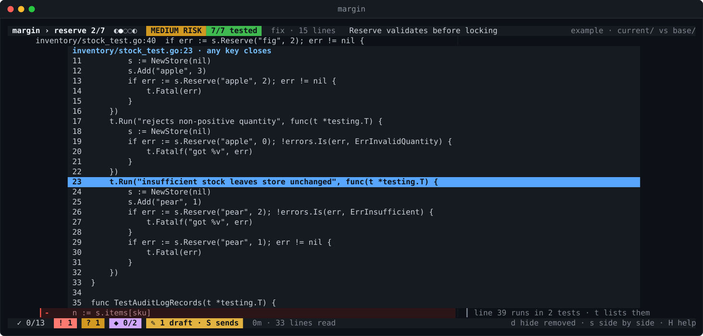

`r` sends the agent the test names and the line, and the agent runs them in its own pane and
reports whether they pass and what each one checks about the line. margin itself still runs
nothing.

For Go, `margin coverage add-go` records where each test is defined. For other languages the
agent can pass `line` with each test; without it margin looks for the definition by name.

### How well is each stop tested?

The overview gives each stop a bar of its changed lines that a test runs, such as
`tested ███████░░░░░ 4/7 changed lines · 3 untested`: green when every changed line runs, amber
when some do, red when none do. The header of a stop repeats the count (`4/7 tested`). Only changed
lines count, and only lines that can run. A high-risk stop with a short bar is where to read
hardest. You can see the bars in the [overview screenshot](#the-overview) above.

### What does each test exercise?

The Tests stop turns into a grid, with the tests down the side, grouped by package or test file
with subtests indented under their parent, and the stops across the top. Each cell shows how much
of that stop's changed code the test runs:

| Cell | Meaning |
| --- | --- |
| `●` | the test runs every changed line of the stop |
| `◐` | it runs some of them |
| `·` | it runs none of them |
| blank | the stop has no changed lines that can run |

The last row counts, per stop, the changed lines no test runs at all. A test marked `new` was added
by the change. A row of `·` is a test that does not touch this change, and a column without `●` or
`◐` is a stop no test reaches.

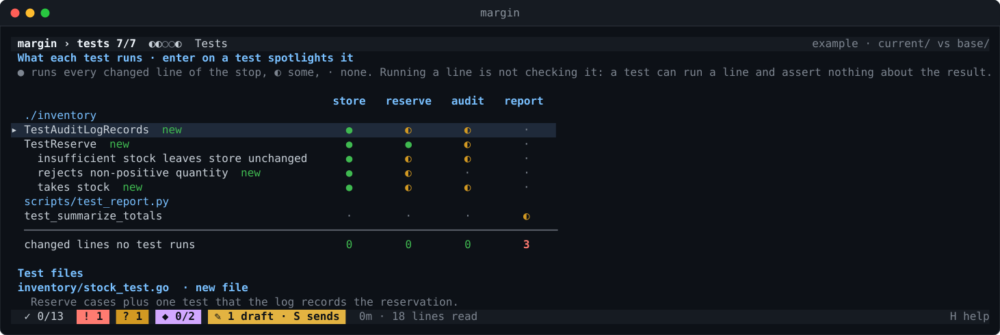

### Which path does one test take through the change?

Press `enter` on a test in the grid to spotlight it. The review jumps to the first changed line
that test runs, and every line the test never reaches is drawn in grey, in every stop, until you
press `esc`. The header names the spotlit test. Below, the test that rejects a non-positive
quantity runs the new check at the top of `Reserve` and returns before anything else:

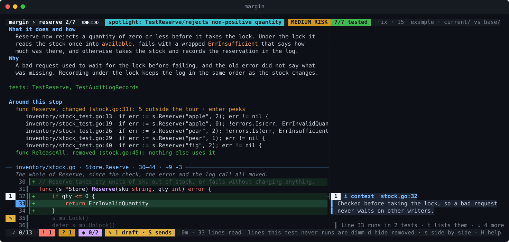

### What coverage does not tell you

Coverage says a test *ran* a line, not that the test checked what the line did: a test can run
every line of a function and assert nothing about its result. The agent is asked to point out
such cases in its notes. Coverage is also tied to the code it was measured on. When a file changes
afterwards, its stops say `coverage stale` and show no marks rather than wrong ones, and the agent
measures again.

### How coverage is measured

margin never runs your tests; the agent does, in its own pane and under its own permissions.

- **Go.** `margin coverage go` writes a short shell script next to the review file. For each
  package with changed files, the script builds the test binary once, lists every test and
  subtest, and runs each one on its own with coverage of all changed packages, so each test's
  lines are known separately. Its last step hands the results to `margin coverage add-go`. The
  agent reads the script and runs it with `sh`. Tests that live in other packages can be added to
  the script by hand.
- **Other languages.** The agent measures per-test coverage with the project's own tool (for
  example pytest with `--cov-context=test`), converts it to this format and passes it to
  `margin coverage add file.json`:

  ```json
  {
    "tests": [
      {"name": "test_summarize_totals", "file": "tests/test_report.py", "line": 8,
       "lines": {"scripts/report.py": [11, 12, 13, 14, 16, 17]}}
    ],
    "executable": {"scripts/report.py": [11, 12, 13, 14, 15, 16, 17]}
  }
  ```

  Line numbers start at 1. `line` is where the test is defined; without it margin searches the
  test file, then the repository, for a definition of the name. `executable` is optional; it separates lines no test ran from lines
  that cannot run at all.

Both commands record a fingerprint of each file, print the changed lines no test runs, and reload
the viewer. Coverage is stored beside the review as `<name>.review.coverage.json`;
`margin coverage clear` removes it.

## Keys

| Key | Action |
| --- | --- |
| `space` | guided walk: next step; after a stop's verdict, the next stop |
| `y` `n` `?` | on the orient screen: the change makes sense / does not (say why) / not sure yet |
| `e` | more text: the whole overview on the orient screen, what and why and examples on a stop's card |
| `b` | guided walk: previous step |
| `1` `2` `3` | the stop's verdict: looks good, needs changes, not sure yet |
| `w` | switch between the guided walk and whole stops (remembered) |
| `j` `k` / arrows, `ctrl+d` `ctrl+u`, `g` `G` | move |
| `}` `{` | next / previous stop |
| `tab` | list of stops |
| `]` `[` | next / previous note |
| `N` | next note the agent added while you were reading |
| `u` `U` | next / previous changed line that no test runs |
| `enter` on a test in the Tests stop | spotlight it: dim every line it does not run |
| `esc` | end a spotlight (after ending a search, if one is on) |
| `t` | list the tests that run the current line: `enter` spotlights one, `p` shows its source, `space` picks, `r` has the agent run them |
| `/` | search the code in every stop; `n` `N` then jump to the next / previous match, `esc` ends the search |
| `enter` | open the selected link, tick a call, answer a `?` question from the agent, or unfold |
| `enter` on a line with notes | read every note on that line at full length in an overlay |
| `enter` on a caller or commit under *Around this stop* | peek at it in an overlay; any key closes |
| `a` | ask about the current line |
| `c` | comment on the current line: pick its kind (`i` `s` `q` `n` `p` `t`, `!` flips blocking), then write it; kept as a draft |
| `S` | send the draft comments to the agent |
| `space` in whole stops | mark the note reviewed, or a call made, and move on (again to undo) |
| `?` | flag the note to come back to (again to undo) |
| `x` | dismiss the note as not useful; in the recap, delete a draft comment |
| `y` | copy the selected note to the clipboard, with its file:line |
| `Y` | copy the whole stop: its rationale, part intros and every note, ready to paste into a PR |
| `v` | blind mode: show the notes on a high-risk stop you read first |
| `F` | filter: all notes, problems with questions and calls, problems only, then each focus area |
| `z` `d` `n` `f` | fold unchanged lines, removed lines, notes column, whole file |
| `s` | side by side: old code left, new code right |
| `h` `l`, `0` | scroll sideways, back to the start |
| `r` | reload |
| `H` | help |
| `q` | quit |

In an overlay (a peek, a full note, a test's source), `j` `k` and `ctrl+d` `ctrl+u` scroll when it
is long and any other key closes it. `H` shows the keys grouped by what you are doing:

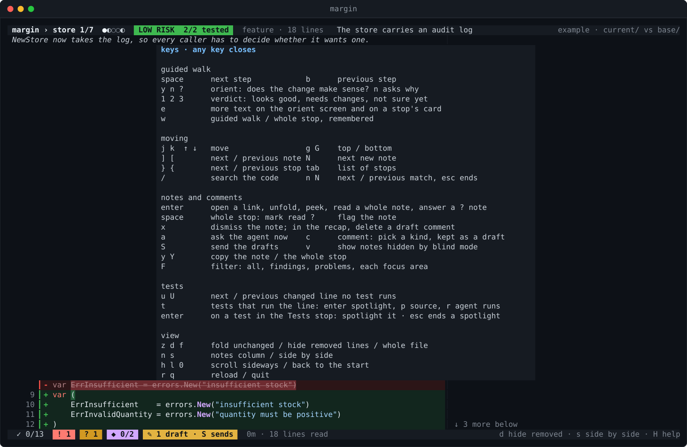

## Posting your review

margin never posts anywhere. `margin export` prints the recommendation with its reasons, your
comments (with the agent's resolution), the notes you flagged with `?`, and your calls as a
checklist, as markdown to paste into a pull request. `margin export --format github` prints the
same as a GitHub review, with the event set from the recommendation (`APPROVE`, `REQUEST_CHANGES`,
or `COMMENT` while the review is not finished), which you can post yourself:

```sh
margin export --format github > review.json
gh api repos/OWNER/REPO/pulls/123/reviews --input review.json
```

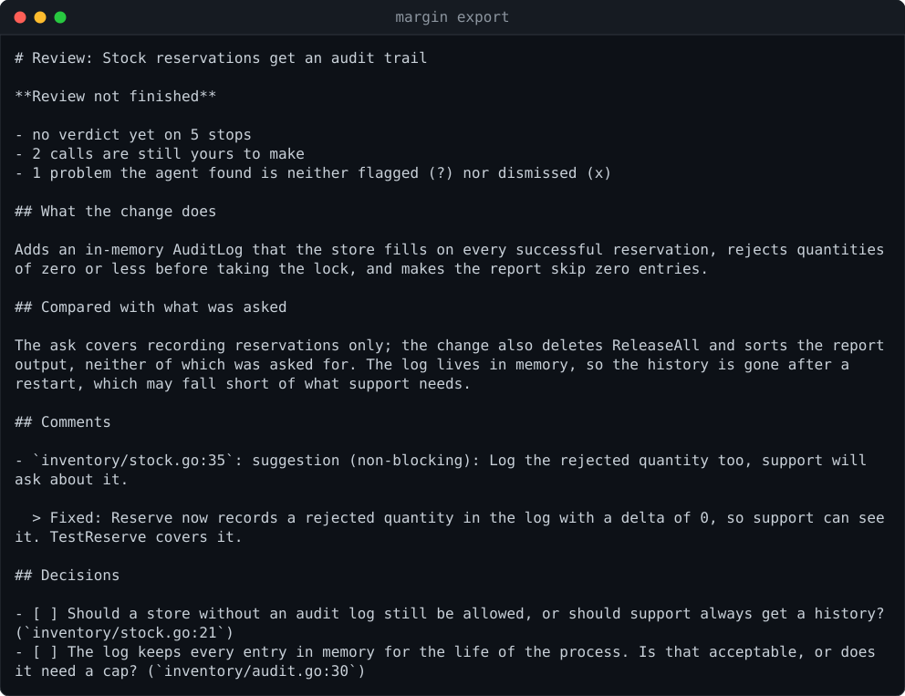

## Repository settings

A repository can keep two files under `.margin/`. margin reads them from the base side of the
review, the commit it compares against, so a change under review cannot rewrite the rules it is
reviewed by.

- `.margin/ignore` lists files that need no stop, one gitignore-style pattern per line (`*.pb.go`,
  `dist/`, `!keep.pb.go`). They are still listed on the overview.
- `.margin/instructions` is review guidance for the agent: conventions, areas that deserve care.
  The agent is told it comes from the repository and is to be used to decide where to look, never
  as instructions to run anything. The overview shows it, together with your own `--instructions`,
  so you can see what the agent was asked to look at.

## For the agent

The agent drives the viewer through the same binary. `margin agent-help` prints its instructions.

```sh
margin note internal/api.go:42 "Validates before the lock, so ..."
margin note internal/api.go:50 --kind decide --focus security "Should ... ?"
margin answer q3 "Because ..."
margin resolve c2 "Fixed: the quantity is logged now."
margin questions               # open questions and sent comments
margin goto api:2              # station "api", note 2
margin goto internal/api.go:42
margin where                   # JSON of what the reader is looking at
margin coverage go             # write a script that measures Go coverage per test
margin coverage add-go DIR     # record the profiles that script collected (it calls this itself)
margin coverage add cov.json   # per-test coverage from any other tool
margin coverage clear          # forget the coverage
```

The review file is plain YAML the agent can also edit to set a summary, `did` and `gap`, regroup
files into stations, write each stop's rationale (`scope`, `what`, `why`), `risk_why` and each
part's `about` line, add unchanged code as a `background: true` part, list `examples` of what the
code did before and does now, write `checks` (the questions the reader should be able to answer
after the stop) and a part's `check` (the question under each of its changes), say in `order_why`
why a stop comes where it does, or add notes anchored by text rather than line numbers, so they survive edits. The agent is asked to
annotate generously, with a note on every changed block rather than only on problems. A
hand-written example is in [`testdata/example`](testdata/example/example.review.yaml) and opens
with `margin open testdata/example/example.review.yaml`.

## Safety

margin is meant for reading code you did not write, so it treats the repository as untrusted.
It never writes to the repository and never executes anything from it; git is only used through
read-only plumbing with refs passed after `--end-of-options`. `--pr` only reads a pull request
through `gh` and never fetches or posts. Terminal escape sequences and bidi controls are stripped
before rendering, and questions are never typed into a pane that runs a plain shell. Commit
messages, pull request descriptions and `.margin/instructions` are written by other people, so they
reach the agent marked as such, and the instructions only from the base side. What the agent does in its own pane is up to the agent and its permissions; that
includes running tests for coverage, which margin only reads.

## Development

`go test ./...` runs the tests; one of them builds and runs a small Go module to check the coverage
script end to end (`-short` skips it). `sh docs/screenshots/shoot.sh` regenerates the screenshots
from the example review, in a private tmux server so it does not touch your own sessions.

## Roadmap

- Light theme
- Word-level highlighting inside changed lines
- Faster loading of large diffs (`git cat-file --batch`)
- Picking up files that start changing while a review is open
- `margin html` export

## License

MIT
